# ⏰ Leoxur Solutions Limited - Employee Time & Expense Portal

Welcome to the **Employee Time & Expense Portal** by **Leoxur Solutions Limited**! This project is a modern, responsive enterprise application designed for employee shift check-ins, check-outs, dynamic hours tracking, interactive roster planning, and unified manager oversight. It also features a fully functional ServiceNow-style IT Tech Support portal.

---

## 📐 Application Architecture

The application is built using the **Django** framework and styled with vanilla CSS (leveraging Outfit and Inter web fonts) to create a premium, glassmorphic corporate dashboard. 

```mermaid
graph TD
    Browser[Web Browser / Client] -->|HTTP Request| DjangoURLs[Django urls.py]
    DjangoURLs -->|Routes to| DjangoViews[Django views.py]
    
    DjangoViews -->|Fetches Rosters & Logs| DB[(SQLite Database)]
    DjangoViews -->|Appends Shift Status| ContextProc[schedule_context_processor]
    
    DjangoViews -->|Renders| Templates[HTML Templates]
    Templates -->|Uses Styles & Scripts| StaticFiles[CSS & JavaScript Bundles]
    
    Browser -->|JSON AJAX POST| APIEndpoints[verify_pin / toggle_attendance API]
    APIEndpoints -->|Check In / Check Out| DB
```



---

## 📁 Step-by-Step File Descriptions

Here is a comprehensive breakdown of the directories and key files in the codebase.

### 1. Main Project Settings
* **[`employee_attendance/settings.py`](employee_attendance/settings.py)**
  * Contains the core settings for the Django framework.
  * Injects `attendance.views.schedule_context_processor` in `TEMPLATES` to ensure the operational shift ticker bar (`schedule_status`) is available globally.
* **[`employee_attendance/urls.py`](employee_attendance/urls.py)**
  * Root URL router that directs initial requests to the `attendance` app.

### 2. Models & Schema
* **[`attendance/models.py`](attendance/models.py)**
  * Defines the database schema:
    * `DepartmentOption`: Stores active departments (e.g. Engineering, HR, Sales & Marketing).
    * `Employee`: Stores active employee profiles, departments, avatar details, and secure 4-digit PINs.
    * `Roster`: Stores shift schedule assignments (`morning`, `afternoon`, `night`) for employees on specific dates.
    * `Attendance`: Logs check-in/out times, status (Present, Late), work modes (Office 🏢, Remote 🏠, Field 🚗), and calculates total hours worked.
    * `EmployeeSupportPermission`: Controls which users can raise support tickets.

### 3. Logic & Routing
* **[`attendance/urls.py`](attendance/urls.py)**
  * Maps URLs to views, handling backwards-compatible route names for integrity.
* **[`attendance/views.py`](attendance/views.py)**
  * Core backend logic:
    * `employee_grid`: Renders the Employee Time & Expense kiosk station.
    * `toggle_attendance`: Manages checking in (records work mode, checks for late check-in) and checking out (computes hours worked).
    * `manager_dashboard`: Aggregates workforce metrics, parses roster date parameters, and serves the employee roster and interactive scheduling table.
    * `assign_roster_shift`: Endpoint to create, update, or delete roster assignments for any date.
    * `ai_chat_command`: Backs the developer customizer page builder, parsing natural language commands to re-order page layout blocks.
* **[`attendance/tests.py`](attendance/tests.py)**
  * Unified test suite containing 27 unit tests validating PIN logic, manager dashboard redirects, layout APIs, and ServiceNow integrations.

### 4. HTML Templates
* **[`attendance/templates/attendance/base.html`](attendance/templates/attendance/base.html)**
  * Main layout containing the global active shift announcement ticker and navigation bar.
* **[`attendance/templates/attendance/student_grid.html`](attendance/templates/attendance/student_grid.html)**
  * The **Employee Time & Expense** check-in kiosk page.
* **[`attendance/templates/attendance/teacher_dashboard.html`](attendance/templates/attendance/teacher_dashboard.html)**
  * The Manager Dashboard with quick stats, an interactive Shift Roster Scheduler table (for date-specific create, update, and delete actions), and override controls.

### 5. Static Assets
* **[`static/css/employee_theme.css`](static/css/employee_theme.css)**
  * Standardized premium stylesheets: glassmorphism, steel-blue color variables, clean border designs, and dark/light modes.
* **[`static/js/employee_attendance.js`](static/js/employee_attendance.js)**
  * Manages AJAX kiosk verification flow, keypad entries, and modal transitions.

---

## 🛠️ IT Tech Services Portal (ServiceNow Theme)

An integrated, ServiceNow-themed IT service portal is available for staff:
* **Ticket Submission**: Users can submit help desk tickets and look up statuses under `/support/`.
* **Tech Services Console**: Located at `/support/engineer/` for authorized support engineers. Allows ticket lifecycle tracking (New, In Progress, On Hold, Resolved, Closed), SLA timer auditing, and internal-only **Work Notes** logging.
* **Identity Manager**: Located at `/support/engineer/identity/`, allows engineers to toggle ticket permissions and engineer assignments.
* **Logout Page**: A dedicated logout confirmation screen at `/support/engineer/logout/` terminates the active engineer session and provides action controls to log back in or return to the main portals.

---

## ⚙️ Running Seeding and Tests (Local/Virtualenv)

To seed the database with configurations and mock data locally, run:

1. **Seed default configurations (departments, avatar emojis, colors):**
   ```bash
   venv/bin/python manage.py seed_configurations
   ```
2. **Seed employee rosters and check-in logs:**
   ```bash
   venv/bin/python seed_data.py
   ```
3. **Execute the automated test suite:**
   ```bash
   venv/bin/python manage.py test
   ```

---

## 🐳 Running in Docker

You can containerize, build, and run the application using **Docker** or **Docker Compose**.

### Method 1: Using Docker Compose (Recommended)
This runs the application using the configuration in `docker-compose.yml`, mapping port `80` on the host to port `8000` in the container and mounting the SQLite database.

1. **Start the services and build the image:**
   ```bash
   docker-compose up --build -d
   ```
2. **Run migrations and seed configuration data inside the running web container:**
   ```bash
   docker-compose exec web python manage.py migrate
   docker-compose exec web python manage.py seed_configurations
   docker-compose exec web python seed_data.py
   ```
3. **Access the application:**
   Open `http://localhost/` in your browser.

---

### Method 2: Using Raw Docker Commands
If you prefer not to use Docker Compose, you can build and run the container directly.

1. **Build the Docker image:**
   ```bash
   docker build -t employee-attendance-app .
   ```
2. **Run the container (exposing port 8000 to port 8000 on host):**
   ```bash
   docker run -d -p 8000:8000 --name employee-attendance-container employee-attendance-app
   ```
3. **Run database migrations and seed default records:**
   ```bash
   docker exec -it employee-attendance-container python manage.py migrate
   docker exec -it employee-attendance-container python manage.py seed_configurations
   docker exec -it employee-attendance-container python seed_data.py
   ```
4. **Access the application:**
   Open `http://localhost:8000/` in your browser.

---

## ☁️ Cloud Deployment Guide (EC2, Azure, GCP)

The most standard and automated way to run this application in a cloud environment is using **Docker** and **Docker Compose**. Here are the deployment steps for major cloud providers:

### 1. AWS EC2 Deployment
1. **Launch an EC2 Instance**:
   - Go to the AWS Console -> EC2 -> Launch Instance.
   - Choose **Ubuntu 22.04 LTS** as the Amazon Machine Image (AMI).
   - Select an instance type (e.g., `t2.micro` or `t3.micro`).
   - Create or select an SSH key pair (`.pem`).
   - Under **Security Groups**, configure inbound rules to allow:
     - **SSH (Port 22)** from your IP.
     - **HTTP (Port 80)** from anywhere (`0.0.0.0/0`).
2. **Connect via SSH**:
   ```bash
   ssh -i "your-key.pem" ubuntu@your-ec2-public-ip
   ```
3. **Install Docker & Docker Compose**:
   ```bash
   sudo apt-get update
   sudo apt-get install -y docker.io docker-compose
   sudo systemctl start docker
   sudo usermod -aG docker ubuntu
   # Log out and log back in to apply group changes
   exit
   ssh -i "your-key.pem" ubuntu@your-ec2-public-ip
   ```
4. **Deploy and Seed**:
   ```bash
   git clone https://github.com/leoxurDev/EmployeeManagementTool.git
   cd EmployeeManagementTool
   docker-compose up --build -d
   docker-compose exec web python manage.py migrate
   docker-compose exec web python manage.py seed_configurations
   docker-compose exec web python seed_data.py
   ```
5. **Access the Portal**:
   - Navigate to the Public IP or DNS of your EC2 instance (`http://your-ec2-ip/`).

---

### 2. Azure Virtual Machine Deployment
1. **Create an Azure VM**:
   - Go to the Azure Portal -> Virtual Machines -> Create.
   - Choose **Ubuntu Server 22.04 LTS** as the Image.
   - Set the size (e.g., `Standard_B1s`).
   - Configure SSH public key authorization.
   - In **Inbound port rules**, allow **SSH (22)** and **HTTP (80)**.
2. **Connect via SSH**:
   ```bash
   ssh azureuser@your-azure-vm-ip
   ```
3. **Install Docker & Docker Compose**:
   ```bash
   sudo apt-get update
   sudo apt-get install -y docker.io docker-compose
   sudo usermod -aG docker azureuser
   exit
   ssh azureuser@your-azure-vm-ip
   ```
4. **Deploy and Seed**:
   ```bash
   git clone https://github.com/leoxurDev/EmployeeManagementTool.git
   cd EmployeeManagementTool
   docker-compose up --build -d
   docker-compose exec web python manage.py migrate
   docker-compose exec web python manage.py seed_configurations
   docker-compose exec web python seed_data.py
   ```
5. **Access the Portal**:
   - Navigate to the Public IP of your Azure Virtual Machine (`http://your-azure-vm-ip/`).

---

### 3. GCP Compute Engine Deployment
1. **Create a VM Instance**:
   - Go to GCP Console -> Compute Engine -> VM Instances -> Create Instance.
   - Choose a machine type (e.g., `e2-micro`).
   - In **Boot Disk**, select **Ubuntu 22.04 LTS**.
   - Under **Firewall**, check **Allow HTTP traffic**.
2. **Connect via SSH**:
   - Click the **SSH** button next to your instance in the GCP console list, or run:
     ```bash
     gcloud compute ssh your-instance-name --zone=your-instance-zone
     ```
3. **Install Docker & Docker Compose**:
   ```bash
   sudo apt-get update
   sudo apt-get install -y docker.io docker-compose
   sudo usermod -aG docker $USER
   exit
   # Re-connect via SSH to apply groups
   ```
4. **Deploy and Seed**:
   ```bash
   git clone https://github.com/leoxurDev/EmployeeManagementTool.git
   cd EmployeeManagementTool
   docker-compose up --build -d
   docker-compose exec web python manage.py migrate
   docker-compose exec web python manage.py seed_configurations
   docker-compose exec web python seed_data.py
   ```
5. **Access the Portal**:
   - Navigate to the External IP of your Compute Engine Instance (`http://your-gcp-vm-ip/`).


