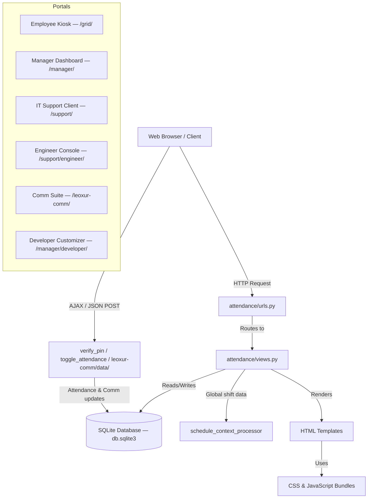

# ⏰ Leoxur Solutions Limited — Employee Time & Management Portal

> A modern, full-featured enterprise portal for employee attendance, shift scheduling, IT support ticketing, and internal communication — built on Django with a premium glassmorphic UI.

---

## 📑 Table of Contents

1. [Application Architecture](#-application-architecture)
2. [Tech Stack](#-tech-stack)
3. [Database Models](#-database-models)
4. [Page-by-Page Guide](#-page-by-page-guide)
   - [Home / Landing Page](#1-home--landing-page)
   - [Employee Time & Expense Kiosk](#2-employee-time--expense-kiosk-grid)
   - [Manager Login & Register](#3-manager-login--register)
   - [Manager Dashboard](#4-manager-dashboard)
   - [Add / Edit / Delete Employee](#5-add--edit--delete-employee)
   - [IT Support Portal (Client)](#6-it-support-portal--client-side)
   - [IT Support Engineer Console](#7-it-support-engineer-console)
   - [Engineer Identity Manager](#8-engineer-identity-manager)
   - [Leoxur Mails & Chat (Comm Suite)](#9-leoxur-mails--chat-communication-suite)
   - [Developer / Admin Customizer](#10-developer--admin-customizer-page)
5. [URL Route Reference](#-url-route-reference)
6. [Static Assets & Stylesheets](#-static-assets--stylesheets)
7. [Local Development Setup](#️-local-development-setup-virtualenv)
8. [Running in Docker](#-running-in-docker)
9. [New Deployment Guide for the Organization](#-new-deployment-guide-for-the-organization)
   - [AWS EC2](#1-aws-ec2-deployment)
   - [Azure VM](#2-azure-virtual-machine-deployment)
   - [GCP Compute Engine](#3-gcp-compute-engine-deployment)
10. [Updating an Existing Deployment](#-updating-an-existing-live-deployment)
11. [Automated Tests](#-automated-tests)

---

## 📐 Application Architecture



---

## 🛠 Tech Stack

| Layer | Technology |
|-------|-----------|
| Backend Framework | Django 4.x |
| Language | Python 3.10 |
| Database | SQLite 3 (file: `db.sqlite3`) |
| Static File Serving | WhiteNoise 6.x |
| WSGI Server (Docker) | Gunicorn |
| Frontend Styling | Vanilla CSS (glassmorphism, CSS variables) |
| Web Fonts | Google Fonts — *Outfit*, *Inter* |
| Frontend Logic | Vanilla JavaScript (AJAX, Fetch API) |
| AI Integration | Google Gemini 2.5 Flash (optional, developer page) |
| Containerization | Docker + Docker Compose |

---

## 🗄 Database Models

> Defined in [`attendance/models.py`](attendance/models.py)

| Model | Purpose |
|-------|---------|
| `DepartmentOption` | Active departments (name, emoji, order) |
| `AvatarEmoji` | Emoji choices for employee avatars |
| `AvatarColor` | Hex color choices for employee avatar backgrounds |
| `Employee` | Employee profiles — name, department, 4-digit PIN, avatar |
| `Roster` | Shift assignments per employee per date (Morning / Afternoon / Night) |
| `Attendance` | Daily check-in/out logs, work mode (Office / Remote / Field), status (Present / Late / Absent), hours worked |
| `AppLayoutBlock` | Persistent block order/visibility for the kiosk page (used by Developer Customizer) |
| `AssignmentGroup` | IT support assignment groups (L2 / L3 / L4 teams) |
| `SupportEngineer` | Engineer accounts for the IT Support Console |
| `SupportTicket` | IT help-desk tickets — priority, state, SLA tracking |
| `TicketActivity` | Work notes and customer comments on tickets |
| `EmployeeSupportPermission` | Per-user permission flag to raise support tickets |
| `LeoxurEmail` | Internal email messages between portal users |
| `LeoxurMessage` | Real-time chat messages (channel or direct) |
| `LeoxurTask` | Internal task cards (Kanban-style) with priority and status |
| `LeoxurTaskComment` | Comments on Leoxur tasks |

---

## 📄 Page-by-Page Guide

### 1. Home / Landing Page

**URL:** `/`  
**Template:** [`attendance/home.html`](attendance/templates/attendance/home.html)  
**View:** `home()`

The public-facing entry point of the portal. Displays the company branding (Leoxur Solutions Limited) and provides navigation links to:
- The **Employee Kiosk** (`/grid/`)
- The **Manager Login** (`/login/`)
- The **IT Support Portal** (`/support/`)
- The **Comm Suite** (`/leoxur-comm/`)

The global **Shift Ticker Bar** (injected via `schedule_context_processor`) appears at the top of every page, showing the currently active shift (Morning 🌅 / Afternoon ☀️ / Night 🌙) with a live clock.

---

### 2. Employee Time & Expense Kiosk (Grid)

**URL:** `/grid/?classroom=<DepartmentName>`  
**Template:** [`attendance/student_grid.html`](attendance/templates/attendance/student_grid.html)  
**View:** `employee_grid()`

This is the self-service check-in station for employees, designed to be used on a shared terminal or tablet.

**Key Features:**
- **Department Tabs** — Switch between active departments (Engineering, HR, Sales & Marketing, etc.)
- **Employee Cards** — Each active employee appears as a card showing their avatar emoji, name, rostered shift, and today's attendance status.
- **PIN Verification Modal** — Clicking an employee card opens a secure 4-digit PIN keypad. Upon success, the employee's current state is displayed (Not Checked In / Checked In / Checked Out).
- **Check-In Flow** — After PIN verification, the employee selects their **Work Mode** (🏢 Office / 🏠 Remote / 🚗 Field) and confirms check-in.
- **Late Detection** — If an employee checks in more than 15 minutes after their shift starts, they are automatically marked **Late ⏰**.
- **Check-Out Flow** — Already checked-in employees see a **Check Out** button. Total hours worked is computed and displayed.
- **Stats Banner** — Shows total employees, present count, and attendance rate for the selected department.
- **Layout Customization** — Block order (header, tabs, stats, grid) is read from `AppLayoutBlock` in the database, allowing admins to reorder via the Developer Customizer.

---

### 3. Manager Login & Register

**URL (Login):** `/login/` or `/manager/login/`  
**URL (Register):** `/manager/register/`  
**Template:** [`attendance/login.html`](attendance/templates/attendance/login.html)  
**Views:** `manager_login()`, `manager_register()`

- **Login** uses Django's built-in `AuthenticationForm`. On success, the manager is redirected to the Manager Dashboard.
- **Registration** is restricted to existing superusers/staff only — regular managers cannot self-register.
- The login page also shows a contextual employee/department overview on the side panel.

---

### 4. Manager Dashboard

**URL:** `/manager/`  
**Template:** [`attendance/teacher_dashboard.html`](attendance/templates/attendance/teacher_dashboard.html)  
**View:** `manager_dashboard()` *(login required)*

The central command panel for managers. Divided into several sections:

**Quick Stats (Today):**
- Total employees, Present, Late, Absent counts with a percentage attendance bar.

**Shift Roster Scheduler:**
- An interactive table showing all employees and their assigned shifts for a selected date (defaults to today).
- Managers can use the date picker to browse past or future dates.
- Each row has a shift dropdown to assign/update/remove a **Morning**, **Afternoon**, or **Night** shift.
- Submitting calls `assign_roster_shift()` which uses `Roster.objects.update_or_create()`.

**Department Filter:**
- A tab/dropdown allows filtering the entire dashboard view by department.

**Export Attendance CSV:**
- The **Export CSV** button (`/manager/export/`) downloads a spreadsheet with:  
  `Employee ID, First Name, Last Name, Department, Rostered Shift, Work Status, Work Mode, Check-in Time, Check-out Time, Hours Worked`

**IT Support Ticket Panel (conditional):**
- If the logged-in user has `can_raise_support = True` (superuser or granted via Developer page), a panel listing all open support tickets is shown at the bottom.

**Employee Management Controls:**
- Links to Add, Edit, and Delete employees (soft-delete, not hard-delete).

---

### 5. Add / Edit / Delete Employee

**URL (Add):** `/manager/add/`  
**URL (Edit):** `/manager/edit/<id>/`  
**URL (Delete):** `/manager/delete/<id>/`  
**Templates:** [`student_form.html`](attendance/templates/attendance/student_form.html), [`student_confirm_delete.html`](attendance/templates/attendance/student_confirm_delete.html)  
**Views:** `add_employee()`, `edit_employee()`, `delete_employee()` *(all login required)*

- **Add/Edit** uses `EmployeeForm` from [`attendance/forms.py`](attendance/forms.py), capturing name, department, avatar emoji, avatar color, and 4-digit PIN.
- **Delete** is a **soft delete** — sets `employee.is_active = False` rather than removing the database record. This preserves historical attendance records.

---

### 6. IT Support Portal — Client Side

**URL (Home):** `/support/`  
**URL (Ticket View):** `/support/ticket/<TKT######>/`  
**Templates:** [`support_home.html`](attendance/templates/attendance/support_home.html), [`support_ticket_detail.html`](attendance/templates/attendance/support_ticket_detail.html)  
**Views:** `support_home()`, `support_ticket_view()`

> **Access:** Requires manager login **and** `EmployeeSupportPermission.can_raise_tickets = True` (or superuser).

**Features:**
- **Raise a Ticket** — Form to submit a help desk ticket with caller name, subject, description, and priority (Low / Moderate / High / Critical).
- **Ticket Search** — Search by ticket number (e.g., `TKT100001`) to quickly look up status.
- **Ticket List** — All existing tickets with state badges (New / In Progress / On Hold / Resolved / Closed).
- **Ticket Detail** — View full ticket info, activity timeline, and add customer comments.

---

### 7. IT Support Engineer Console

**URL (Login):** `/support/engineer/login/`  
**URL (Dashboard):** `/support/engineer/`  
**URL (Ticket Detail):** `/support/engineer/ticket/<TKT######>/`  
**URL (Logout):** `/support/engineer/logout/`  
**Templates:** [`engineer_login.html`](attendance/templates/attendance/support/engineer_login.html), [`engineer_dashboard.html`](attendance/templates/attendance/support/engineer_dashboard.html), [`engineer_ticket_detail.html`](attendance/templates/attendance/support/engineer_ticket_detail.html), [`engineer_logout.html`](attendance/templates/attendance/support/engineer_logout.html)  
**Views:** `engineer_login_view()`, `engineer_dashboard()`, `engineer_ticket_detail()`, `engineer_logout_view()`

> **Access:** Engineers log in with their email + password via a separate session (`request.session['engineer_id']`), independent of the manager Django auth.

**Engineer Dashboard Features:**
- Lists all support tickets with filter controls by **Assignment Group**, **State**, and **Priority**.
- SLA status badge on each ticket (🟢 Active / 🟡 Warning / 🔴 Breached / ✅ Met).
- Ticket count summary pills by state.

**Ticket Detail Features:**
- Full ticket lifecycle management: update **state**, **priority**, **assigned engineer**, **assignment group**.
- Add **Work Notes** (internal only — not visible to the client).
- Add **Customer Comments** (visible to both engineer and client).
- SLA timer display showing time remaining or breach duration.
- Full activity log timeline.

**Engineer CRUD (Identity Manager sub-pages):**
- `/support/engineer/list/` — List all engineers.
- `/support/engineer/create/` — Create a new engineer account.
- `/support/engineer/edit/<id>/` — Edit engineer details.
- `/support/engineer/delete/<id>/` — Delete engineer (with confirmation).

**Group CRUD:**
- `/support/group/list/` — List assignment groups.
- `/support/group/create/` — Create new group (e.g., "L2 Support Team").
- `/support/group/edit/<id>/` — Edit group.
- `/support/group/delete/<id>/` — Delete group.

---

### 8. Engineer Identity Manager

**URL:** `/support/engineer/identity/`  
**Template:** [`identity_manager.html`](attendance/templates/attendance/support/identity_manager.html)  
**View:** `identity_manager()`

A unified admin panel for the IT Support infrastructure:
- **Toggle engineer active/inactive status.**
- **Assign/remove engineers from assignment groups.**
- **Grant or revoke support-ticket-raising permissions** for manager users.
- View a full list of all engineers with their group memberships.

---

### 9. Leoxur Mails & Chat Communication Suite

**URL (Dashboard):** `/leoxur-comm/`  
**URL (Auth):** `/leoxur-comm/auth/`  
**URL (Logout):** `/leoxur-comm/logout/`  
**URL (Data API):** `/leoxur-comm/data/`  
**Template:** [`leoxur_comm.html`](attendance/templates/attendance/leoxur_comm.html)  
**Stylesheet:** [`static/css/leoxur_comm.css`](static/css/leoxur_comm.css)  
**Views:** `leoxur_comm_dashboard()`, `leoxur_comm_auth()`, `leoxur_comm_logout()`, `leoxur_comm_data()`

A fully integrated internal communication hub styled as a modern messaging app.

**Authentication:**
- Users log in as one of three roles: **Employee**, **Manager**, or **Engineer**, mapped to user IDs (e.g., `employee_1`, `manager_1`, `engineer_2`).
- Session stored as `leoxur_user_id`.

**Three Core Modules:**

#### 📧 Mails (Internal Email)
- Compose and send internal emails to any registered user.
- Inbox/Sent/All views.
- Mark emails as read.
- API endpoints: `/leoxur-comm/send-email/`, `/leoxur-comm/read-email/`
- Backed by `LeoxurEmail` model.

#### 💬 Chat (Team Channels + Direct Messages)
- **Channel rooms**: `#general`, `#support`, `#managers`, `#announcements`
- **Direct Messages**: User-to-user DMs.
- Real-time-style chat UI (AJAX polling).
- Message threading / replies support (`parent_message` FK).
- API endpoint: `/leoxur-comm/send-chat/`
- Backed by `LeoxurMessage` model.

#### ✅ Tasks (Kanban Task Board)
- Create tasks with title, description, priority (Low / Medium / High / Highest), and status (Backlog / In Progress / In Review / Done / Archived).
- Assign tasks to other users.
- Comment on tasks.
- Kanban board view grouped by status.
- API endpoints: `/leoxur-comm/create-task/`, `/leoxur-comm/update-task/`, `/leoxur-comm/delete-task/`, `/leoxur-comm/add-task-comment/`
- Backed by `LeoxurTask` and `LeoxurTaskComment` models.

---

### 10. Developer / Admin Customizer Page

**URL:** `/manager/developer/`  
**Template:** [`attendance/developer_page.html`](attendance/templates/attendance/developer_page.html)  
**Views:** `admin_developer_page()`, `save_layout()`, `ai_chat_command()`  
**Access:** Superuser / staff only.

**Features:**
- **Layout Block Manager** — Drag-and-drop (or command-driven) reordering of the kiosk page blocks: `Branding Header`, `Department Selection Tabs`, `Roster Stats Banner`, `Employee Roster Grid`.
  - Toggle block visibility (show/hide).
  - Drag to reorder, saved via `save_layout()` API.
- **AI Chat Command Interface** — Type natural language commands such as:
  - `"hide the stats banner"` → Hides `stats_banner` block.
  - `"move student grid to top"` → Reorders `student_grid` to position 1.
  - `"reset layout"` → Restores default order and visibility.
  - Optionally powered by **Gemini 2.5 Flash API** (enter API key in the UI). Falls back to offline keyword parsing if no key is provided.
- **Support Ticket Permissions** — A table of all manager users with a toggle to grant or revoke their ability to raise IT support tickets.

---

## 🔗 URL Route Reference

| URL Pattern | View | Description |
|-------------|------|-------------|
| `/` | `home` | Landing page |
| `/grid/` | `employee_grid` | Employee kiosk |
| `/verify-pin/` | `verify_pin` | AJAX PIN verification |
| `/toggle-attendance/` | `toggle_attendance` | AJAX check-in/check-out |
| `/login/` | `manager_login` | Unified manager login |
| `/manager/login/` | `manager_login` | Manager login (alias) |
| `/manager/register/` | `manager_register` | Manager registration (admin only) |
| `/manager/logout/` | `manager_logout` | Manager logout |
| `/manager/` | `manager_dashboard` | Manager dashboard |
| `/manager/add/` | `add_employee` | Add employee |
| `/manager/edit/<id>/` | `edit_employee` | Edit employee |
| `/manager/delete/<id>/` | `delete_employee` | Delete (soft) employee |
| `/manager/export/` | `export_attendance_csv` | Export attendance to CSV |
| `/manager/roster/assign/` | `assign_roster_shift` | Assign/update roster shift |
| `/manager/developer/` | `admin_developer_page` | Developer customizer |
| `/manager/developer/save/` | `save_layout` | Save block layout (AJAX) |
| `/manager/developer/chat/` | `ai_chat_command` | AI layout command (AJAX) |
| `/support/` | `support_home` | IT support client portal |
| `/support/ticket/<num>/` | `support_ticket_view` | Client ticket detail |
| `/support/engineer/login/` | `engineer_login_view` | Engineer login |
| `/support/engineer/logout/` | `engineer_logout_view` | Engineer logout |
| `/support/engineer/` | `engineer_dashboard` | Engineer ticket console |
| `/support/engineer/ticket/<num>/` | `engineer_ticket_detail` | Engineer ticket detail |
| `/support/engineer/identity/` | `identity_manager` | Identity & permissions manager |
| `/support/engineer/list/` | `engineer_list` | List all engineers |
| `/support/engineer/create/` | `engineer_create` | Create engineer |
| `/support/engineer/edit/<id>/` | `engineer_edit` | Edit engineer |
| `/support/engineer/delete/<id>/` | `engineer_delete` | Delete engineer |
| `/support/group/list/` | `group_list` | List assignment groups |
| `/support/group/create/` | `group_create` | Create group |
| `/support/group/edit/<id>/` | `group_edit` | Edit group |
| `/support/group/delete/<id>/` | `group_delete` | Delete group |
| `/leoxur-comm/` | `leoxur_comm_dashboard` | Comm suite dashboard |
| `/leoxur-comm/auth/` | `leoxur_comm_auth` | Comm suite login |
| `/leoxur-comm/logout/` | `leoxur_comm_logout` | Comm suite logout |
| `/leoxur-comm/data/` | `leoxur_comm_data` | Comm data API (AJAX) |
| `/leoxur-comm/send-email/` | `leoxur_send_email` | Send internal email |
| `/leoxur-comm/send-chat/` | `leoxur_send_chat` | Send chat message |
| `/leoxur-comm/read-email/` | `leoxur_read_email` | Mark email as read |
| `/leoxur-comm/create-task/` | `leoxur_create_task` | Create task |
| `/leoxur-comm/update-task/` | `leoxur_update_task` | Update task status/priority |
| `/leoxur-comm/delete-task/` | `leoxur_delete_task` | Delete task |
| `/leoxur-comm/add-task-comment/` | `leoxur_create_task_comment` | Add task comment |

---

## 🎨 Static Assets & Stylesheets

| File | Purpose |
|------|---------|
| [`static/css/employee_theme.css`](static/css/employee_theme.css) | Core glassmorphic theme — CSS variables, dark sidebar, shift ticker, employee cards, modal keypad, dashboard tables |
| [`static/css/servicenow_theme.css`](static/css/servicenow_theme.css) | ServiceNow-inspired theme for all IT Support portal pages — ticket badges, SLA indicators, activity log |
| [`static/css/leoxur_comm.css`](static/css/leoxur_comm.css) | Full UI for the Mails, Chat, and Task communication suite — sidebar, message bubbles, kanban columns |
| [`static/js/employee_attendance.js`](static/js/employee_attendance.js) | All frontend JavaScript — PIN keypad, AJAX check-in/out, shift ticker clock, roster form submission, Leoxur Comm module (emails, chat, tasks) |

---

## ⚙️ Local Development Setup (Virtualenv)

```bash
# 1. Clone the repository
git clone https://github.com/leoxurDev/EmployeeManagementTool.git
cd EmployeeManagementTool

# 2. Create and activate a Python virtual environment
python3 -m venv venv
source venv/bin/activate          # macOS / Linux
# venv\Scripts\activate           # Windows

# 3. Install dependencies
pip install -r requirements.txt

# 4. Apply database migrations
python manage.py migrate

# 5. Seed default configuration data (departments, avatars, colors)
python manage.py seed_configurations

# 6. (Optional) Seed sample employees, rosters, and attendance logs
python seed_data.py

# 7. Create a superuser manager account
python manage.py createsuperuser

# 8. Run the development server
python manage.py runserver
```

Open `http://127.0.0.1:8000/` in your browser.

---

## 🐳 Running in Docker

### Method 1: Docker Compose (Recommended)

```bash
# 1. Build and start services
docker-compose up --build -d

# 2. Run migrations inside the container
docker-compose exec web python manage.py migrate

# 3. Seed configuration data
docker-compose exec web python manage.py seed_configurations

# 4. (Optional) Seed sample data
docker-compose exec web python seed_data.py

# 5. Create a superuser
docker-compose exec web python manage.py createsuperuser
```

Open `http://localhost/` (port 80 maps to container port 8000).

---

### Method 2: Raw Docker Commands

```bash
# 1. Build the image
docker build -t employee-attendance-app .

# 2. Run the container
docker run -d -p 8000:8000 \
  -v $(pwd)/db.sqlite3:/app/db.sqlite3 \
  --name employee-attendance-container \
  employee-attendance-app

# 3. Apply migrations
docker exec -it employee-attendance-container python manage.py migrate

# 4. Seed configurations
docker exec -it employee-attendance-container python manage.py seed_configurations

# 5. (Optional) Seed sample data
docker exec -it employee-attendance-container python seed_data.py

# 6. Create a superuser
docker exec -it employee-attendance-container python manage.py createsuperuser
```

Open `http://localhost:8000/` in your browser.

---

## ☁️ New Deployment Guide for the Organization

> These steps cover deploying the application **from scratch** to a new cloud server. For **updating** an existing running deployment, see the [Updating an Existing Deployment](#-updating-an-existing-live-deployment) section below.

### Prerequisites (All Providers)
- A Linux VM (Ubuntu 22.04 LTS recommended).
- Inbound ports **22 (SSH)** and **80 (HTTP)** open in the firewall / security group.
- Docker and Docker Compose installed (see step 3 for each provider).
- Git access to the repository.

---

### 1. AWS EC2 Deployment

#### Step 1 — Launch an EC2 Instance
1. Go to **AWS Console → EC2 → Launch Instance**.
2. Choose **Ubuntu Server 22.04 LTS** as the AMI.
3. Choose an instance type — `t3.micro` is sufficient for small teams; use `t3.small` or higher for larger organizations.
4. Create or select an existing **SSH key pair** (`.pem` file).
5. In **Security Groups**, add inbound rules:
   - **SSH (Port 22)** — from your organization's IP.
   - **HTTP (Port 80)** — from `0.0.0.0/0` (all).

#### Step 2 — Connect via SSH
```bash
ssh -i "your-key.pem" ubuntu@<EC2-PUBLIC-IP>
```

#### Step 3 — Install Docker & Docker Compose
```bash
sudo apt-get update
sudo apt-get install -y docker.io docker-compose
sudo systemctl start docker
sudo systemctl enable docker
sudo usermod -aG docker ubuntu
# Log out and reconnect to apply group permissions
exit
ssh -i "your-key.pem" ubuntu@<EC2-PUBLIC-IP>
```

#### Step 4 — Deploy the Application
```bash
git clone https://github.com/leoxurDev/EmployeeManagementTool.git
cd EmployeeManagementTool

docker-compose up --build -d
docker-compose exec web python manage.py migrate
docker-compose exec web python manage.py seed_configurations
docker-compose exec web python seed_data.py
docker-compose exec web python manage.py createsuperuser
```

#### Step 5 — Access the Portal
Open `http://<EC2-PUBLIC-IP>/` in your browser.

---

### 2. Azure Virtual Machine Deployment

#### Step 1 — Create an Azure VM
1. Go to **Azure Portal → Virtual Machines → Create**.
2. Choose **Ubuntu Server 22.04 LTS** as the image.
3. Set size to `Standard_B1s` (small teams) or `Standard_B2s` (larger).
4. Configure **SSH public key** authentication.
5. Under **Inbound port rules**, allow **SSH (22)** and **HTTP (80)**.

#### Step 2 — Connect via SSH
```bash
ssh azureuser@<AZURE-VM-IP>
```

#### Step 3 — Install Docker & Docker Compose
```bash
sudo apt-get update
sudo apt-get install -y docker.io docker-compose
sudo systemctl start docker
sudo systemctl enable docker
sudo usermod -aG docker azureuser
exit
ssh azureuser@<AZURE-VM-IP>
```

#### Step 4 — Deploy the Application
```bash
git clone https://github.com/leoxurDev/EmployeeManagementTool.git
cd EmployeeManagementTool

docker-compose up --build -d
docker-compose exec web python manage.py migrate
docker-compose exec web python manage.py seed_configurations
docker-compose exec web python seed_data.py
docker-compose exec web python manage.py createsuperuser
```

#### Step 5 — Access the Portal
Open `http://<AZURE-VM-IP>/` in your browser.

---

### 3. GCP Compute Engine Deployment

#### Step 1 — Create a VM Instance
1. Go to **GCP Console → Compute Engine → VM Instances → Create Instance**.
2. Choose machine type `e2-small` (recommended) or `e2-micro` (minimal).
3. In **Boot Disk**, select **Ubuntu 22.04 LTS**.
4. Under **Firewall**, check **Allow HTTP traffic**.

#### Step 2 — Connect via SSH
```bash
gcloud compute ssh <INSTANCE-NAME> --zone=<ZONE>
# Or use the SSH button in the GCP Console
```

#### Step 3 — Install Docker & Docker Compose
```bash
sudo apt-get update
sudo apt-get install -y docker.io docker-compose
sudo systemctl start docker
sudo systemctl enable docker
sudo usermod -aG docker $USER
exit
# Reconnect
gcloud compute ssh <INSTANCE-NAME> --zone=<ZONE>
```

#### Step 4 — Deploy the Application
```bash
git clone https://github.com/leoxurDev/EmployeeManagementTool.git
cd EmployeeManagementTool

docker-compose up --build -d
docker-compose exec web python manage.py migrate
docker-compose exec web python manage.py seed_configurations
docker-compose exec web python seed_data.py
docker-compose exec web python manage.py createsuperuser
```

#### Step 5 — Access the Portal
Open `http://<GCP-EXTERNAL-IP>/` in your browser.

---

## 🔄 Updating an Existing Live Deployment

Use these steps whenever code changes are pushed to the repository and you need to update the running production server.

```bash
# 1. SSH into the server
ssh -i "your-key.pem" ubuntu@<SERVER-IP>

# 2. Navigate to the project directory
cd EmployeeManagementTool

# 3. Pull the latest changes from Git
git pull origin main

# 4. Rebuild and restart Docker containers
#    (--build rebuilds the image; --no-deps avoids rebuilding dependencies unless changed)
docker-compose up --build -d

# 5. Apply any new database migrations
docker-compose exec web python manage.py migrate

# 6. Re-run seed_configurations ONLY if new departments/avatars/colors were added
#    (safe to re-run — it skips existing records)
docker-compose exec web python manage.py seed_configurations

# 7. Verify the application is running correctly
docker-compose ps
docker-compose logs web --tail=50
```

Open the server's public IP in your browser to confirm the update is live.

### ⚠️ Important Notes for Updates
- **Database:** The `db.sqlite3` file is mounted as a Docker volume (`./db.sqlite3:/app/db.sqlite3`), so it persists across container restarts and rebuilds. **Never delete it on the server.**
- **Migrations:** Always run `migrate` after a code update. If models changed, new migration files will be in `attendance/migrations/` — these are applied automatically.
- **Static Files:** `collectstatic` runs automatically during the Docker image build step (`RUN python manage.py collectstatic --noinput` in `Dockerfile`), so no manual action is needed.
- **Zero-Downtime:** For true zero-downtime deployments, consider using `docker-compose up -d --no-deps --build web` to rebuild only the `web` service.

---

## 🧪 Automated Tests

The project includes a unified test suite in [`attendance/tests.py`](attendance/tests.py) covering:
- PIN verification logic (valid, invalid, and employee-not-found scenarios).
- Manager dashboard authentication and redirect behavior.
- Layout API (save and reset block order).
- ServiceNow IT support ticket creation and state transitions.
- SLA calculation logic.

**Run all tests locally:**
```bash
python manage.py test
# or with venv:
venv/bin/python manage.py test
```

**Run tests inside Docker:**
```bash
docker-compose exec web python manage.py test
```

---

## 📋 Project File Structure

```
EmployeeManagementTool/
├── attendance/
│   ├── management/
│   │   └── commands/
│   │       └── seed_configurations.py   # Seeds departments, avatar emojis, colors
│   ├── migrations/                      # Django database migration files
│   ├── templates/
│   │   └── attendance/
│   │       ├── base.html                # Global layout (shift ticker, nav)
│   │       ├── home.html                # Landing page
│   │       ├── student_grid.html        # Employee kiosk check-in
│   │       ├── teacher_dashboard.html   # Manager dashboard
│   │       ├── login.html               # Manager login/register
│   │       ├── student_form.html        # Add/edit employee form
│   │       ├── student_confirm_delete.html
│   │       ├── developer_page.html      # Admin customizer & AI chat
│   │       ├── leoxur_comm.html         # Mails, Chat & Tasks suite
│   │       ├── support_home.html        # IT support client portal
│   │       ├── support_ticket_detail.html
│   │       └── support/
│   │           ├── support_base.html
│   │           ├── engineer_login.html
│   │           ├── engineer_logout.html
│   │           ├── engineer_dashboard.html
│   │           ├── engineer_ticket_detail.html
│   │           ├── identity_manager.html
│   │           ├── engineer_list.html
│   │           ├── engineer_form.html
│   │           ├── engineer_confirm_delete.html
│   │           ├── group_list.html
│   │           ├── group_form.html
│   │           └── group_confirm_delete.html
│   ├── admin.py                         # Django admin registrations
│   ├── apps.py
│   ├── forms.py                         # EmployeeForm
│   ├── models.py                        # All database models
│   ├── tests.py                         # Automated test suite
│   ├── urls.py                          # URL routing
│   └── views.py                         # All view logic
├── employee_attendance/
│   ├── settings.py                      # Django settings (context processor, whitenoise)
│   ├── urls.py                          # Root URL dispatcher
│   └── wsgi.py
├── static/
│   ├── css/
│   │   ├── employee_theme.css           # Main portal theme
│   │   ├── servicenow_theme.css         # IT support portal theme
│   │   └── leoxur_comm.css             # Comm suite theme
│   └── js/
│       └── employee_attendance.js       # All frontend JS logic
├── Dockerfile                           # Docker image definition
├── docker-compose.yml                   # Docker Compose service config
├── manage.py                            # Django management entry point
├── requirements.txt                     # Python dependencies
├── seed_data.py                         # Sample employee/roster/attendance seeder
└── db.sqlite3                           # SQLite database file
```

---

## 📄 License

This project is licensed under the **Apache License 2.0**. See the [`LICENSE`](LICENSE) file for full details.

---

*Built with ❤️ by the Leoxur Solutions Limited development team.*
