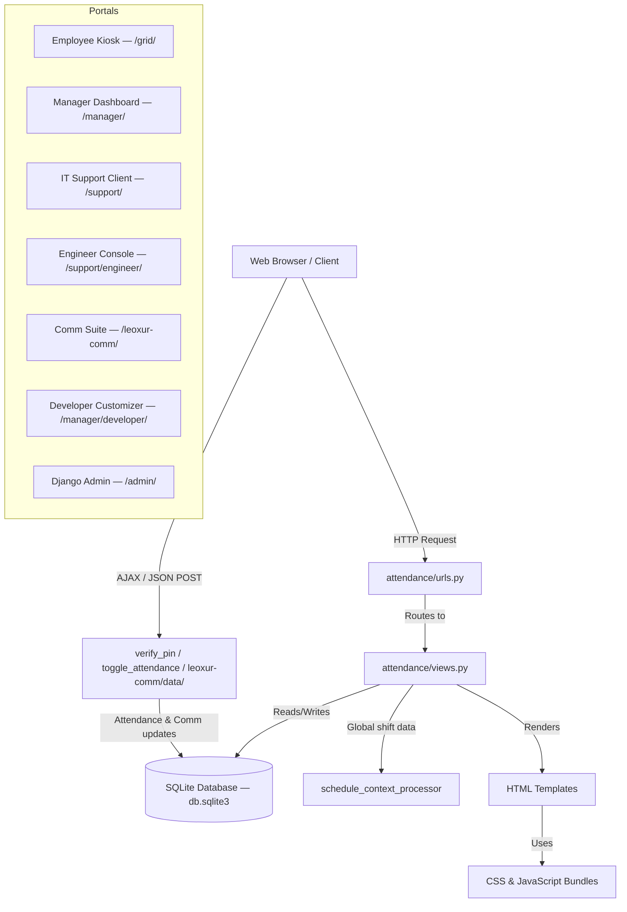

# ⏰ Leoxur Solutions Limited — Employee Time & Management Portal

> A modern, full-featured enterprise portal for employee attendance, shift scheduling, IT support ticketing, and internal communication — built on Django with a premium glassmorphic UI.

---

## 📑 Table of Contents

1. [Application Architecture](#-application-architecture)
2. [Tech Stack](#-tech-stack)
3. [Database Models](#-database-models)
4. [Page-by-Page Guide](#-page-by-page-guide)
   - [Home / Landing Page](#1-home--landing-page)
   - [Employee Time & Expense Kiosk](#2-employee-time--expense-kiosk-grid)
   - [Manager Login & Register](#3-manager-login--register)
   - [Manager Dashboard](#4-manager-dashboard)
   - [Add / Edit / Delete Employee](#5-add--edit--delete-employee)
   - [IT Support Portal (Client)](#6-it-support-portal--client-side)
   - [IT Support Engineer Console](#7-it-support-engineer-console)
   - [Engineer Identity Manager](#8-engineer-identity-manager)
   - [Leoxur Mails & Chat (Comm Suite)](#9-leoxur-mails--chat-communication-suite)
   - [Developer / Admin Customizer](#10-developer--admin-customizer-page)
   - [Django Admin Panel](#11-django-admin-panel)
5. [URL Route Reference](#-url-route-reference)
6. [Static Assets & Stylesheets](#-static-assets--stylesheets)
7. [Local Development Setup](#️-local-development-setup-virtualenv)
8. [Running in Docker](#-running-in-docker)
9. [New Deployment Guide for the Organization](#-new-deployment-guide-for-the-organization)
   - [AWS EC2](#1-aws-ec2-deployment)
   - [Azure VM](#2-azure-virtual-machine-deployment)
   - [GCP Compute Engine](#3-gcp-compute-engine-deployment)
10. [Updating an Existing Deployment](#-updating-an-existing-live-deployment)
11. [Migrating Database (SQLite to PostgreSQL)](#-migrating-database-sqlite-to-postgresql)
12. [Production Security Checklist](#-production-security-checklist)
13. [Automated Tests](#-automated-tests)
14. [Project File Structure](#-project-file-structure)

---

## 📐 Application Architecture



---

## 🛠 Tech Stack

| Layer | Technology |
|-------|-----------|
| Backend Framework | Django 4.2.x |
| Language | Python 3.10 |
| Database | SQLite 3 (file: `db.sqlite3`) |
| Static File Serving | WhiteNoise 6.x |
| WSGI Server (Docker) | Gunicorn |
| Frontend Styling | Vanilla CSS (glassmorphism, CSS variables) |
| Web Fonts | Google Fonts — *Outfit*, *Inter* |
| Frontend Logic | Vanilla JavaScript (AJAX, Fetch API) |
| AI Integration | Google Gemini 2.5 Flash (optional, developer page) |
| Containerization | Docker + Docker Compose |
| Default Timezone | Asia/Kolkata (IST — UTC+5:30) |
| Session Management | 30-minute inactivity expiry, browser-close reset |

---

## 🗄 Database Models

> Defined in [`attendance/models.py`](attendance/models.py)

| Model | Purpose |
|-------|---------|
| `DepartmentOption` | Active departments (name, emoji, order) |
| `AvatarEmoji` | Emoji choices for employee avatars |
| `AvatarColor` | Hex color choices for employee avatar backgrounds |
| `Employee` | Employee profiles — name, department, 6-digit PIN, avatar |
| `Roster` | Shift assignments per employee per date (Morning / Afternoon / Night) |
| `Attendance` | Daily check-in/out logs, work mode (Office / Remote / Field), status (Present / Late / Absent), hours worked |
| `AppLayoutBlock` | Persistent block order/visibility for the kiosk page (used by Developer Customizer) |
| `AssignmentGroup` | IT support assignment groups (L2 / L3 / L4 teams) |
| `SupportEngineer` | Engineer accounts for the IT Support Console |
| `SupportTicket` | IT help-desk tickets — priority, state, SLA tracking |
| `TicketActivity` | Work notes and customer comments on tickets |
| `EmployeeSupportPermission` | Per-user permission flag to raise support tickets |
| `LeoxurEmail` | Internal email messages between portal users |
| `LeoxurMessage` | Real-time chat messages (channel or direct) |
| `LeoxurTask` | Internal task cards (Kanban-style) with priority and status |
| `LeoxurTaskComment` | Comments on Leoxur tasks |

### Shift Time Definitions

| Shift | Hours |
|-------|-------|
| 🌅 Morning | 06:00 AM – 02:00 PM |
| ☀️ Afternoon | 02:00 PM – 10:00 PM |
| 🌙 Night | 10:00 PM – 06:00 AM |

> **Late Detection Rule:** An employee is marked **Late ⏰** if they check in more than **15 minutes** after their assigned shift starts.

### SLA Durations by Priority

| Priority | SLA Window |
|----------|-----------|
| Critical | 1 hour |
| High | 4 hours |
| Moderate | 8 hours |
| Low | 24 hours |

---

## 📄 Page-by-Page Guide

### 1. Home / Landing Page

**URL:** `/`
**Template:** [`attendance/home.html`](attendance/templates/attendance/home.html)
**View:** `home()`

The public-facing entry point of the portal. Displays the company branding (Leoxur Solutions Limited) and provides navigation links to:
- The **Employee Kiosk** (`/grid/`)
- The **Manager Login** (`/login/`)
- The **IT Support Portal** (`/support/`)
- The **Comm Suite** (`/leoxur-comm/`)

The global **Shift Ticker Bar** (injected via `schedule_context_processor`) appears at the top of every page, showing the currently active shift (Morning 🌅 / Afternoon ☀️ / Night 🌙) with a live clock and milestone progress indicators.

**No authentication required** — this page is publicly accessible.

---

### 2. Employee Time & Expense Kiosk (Grid)

**URL:** `/grid/?classroom=<DepartmentName>`
**Template:** [`attendance/employee_grid.html`](attendance/templates/attendance/employee_grid.html)
**View:** `employee_grid()`

This is the self-service check-in station for employees, designed to be used on a shared terminal or tablet in a common area.

**Key Features:**

- **Department Tabs** — Switch between active departments (Engineering, HR, Sales & Marketing, etc.). The tab list is dynamically populated from the `DepartmentOption` database table.
- **Employee Cards** — Each active employee appears as a card showing their avatar emoji, colored background, name, rostered shift, and today's attendance status badge.
- **PIN Verification Modal** — Clicking an employee card opens a secure 6-digit PIN keypad overlay. The PIN is verified via an AJAX call to `/verify-pin/`.
- **Check-In Flow** — After PIN verification, if the employee has not yet checked in, they are shown their current state and a **Work Mode** selector:
  - 🏢 Office
  - 🏠 Remote
  - 🚗 Field
  - Confirmation triggers `/toggle-attendance/` with `action=check_in`.
- **Late Detection** — If an employee checks in more than 15 minutes after their rostered shift start, they are automatically marked **Late ⏰**.
- **Check-Out Flow** — Already checked-in employees see a **Check Out** button. On confirmation, `checked_out_at` is recorded and total hours worked is displayed.
- **Stats Banner** — Shows total employees, present count, and attendance rate (%) for the selected department.
- **Layout Customization** — Block order (header, tabs, stats, grid) is read from the `AppLayoutBlock` table. If no records exist, defaults are seeded automatically. Admins can reorder/hide blocks using the Developer Customizer page.

**Access:** No login required — intended for kiosk/shared-terminal use.

---

### 3. Manager Login & Register

**URL (Login):** `/login/` or `/manager/login/`
**URL (Register):** `/manager/register/`
**Template:** [`attendance/login.html`](attendance/templates/attendance/login.html)
**Views:** `manager_login()`, `manager_register()`

- **Login** uses Django's built-in `AuthenticationForm`. On success, the manager is redirected to the Manager Dashboard (`/manager/`).
- The login page also shows a contextual employee count and department overview in the side panel.
- **Registration** is strictly restricted — only existing **staff or superuser** accounts can access `/manager/register/`. Regular managers cannot self-register new accounts.
- Sessions expire after **30 minutes of inactivity** or when the browser is closed (`SESSION_EXPIRE_AT_BROWSER_CLOSE = True`, `SESSION_COOKIE_AGE = 1800`).

---

### 4. Manager Dashboard

**URL:** `/manager/`
**Template:** [`attendance/manager_dashboard.html`](attendance/templates/attendance/manager_dashboard.html)
**View:** `manager_dashboard()` *(login required)*

The central command panel for managers. Divided into several sections:

**Quick Stats (Today):**
- Total employees, Present, Late, Absent counts.
- Visual attendance percentage bar.

**Shift Roster Scheduler:**
- An interactive table showing all employees and their assigned shifts for a selected date (defaults to today).
- Managers can use the **date picker** to browse past or future dates.
- Each row has a shift dropdown to assign/update/remove a **Morning**, **Afternoon**, or **Night** shift.
- Submitting calls `assign_roster_shift()` which uses `Roster.objects.update_or_create()`.
- Selecting `-- Remove Shift --` deletes the roster entry for that employee on that date.

**Department Filter:**
- A tab/dropdown allows filtering the entire dashboard view by department. Defaults to **All Departments**.

**Export Attendance CSV:**
- The **Export CSV** button (`/manager/export/`) downloads a spreadsheet with:
  `Employee ID, First Name, Last Name, Department, Rostered Shift, Work Status, Work Mode, Check-in Time, Check-out Time, Hours Worked`

**IT Support Ticket Panel (conditional):**
- If the logged-in user has `can_raise_support = True` (superuser or granted via Developer page), a panel listing all open support tickets is shown at the bottom of the dashboard.

**Employee Management Controls:**
- Links to Add, Edit, and Delete employees (soft-delete — `is_active = False`, not hard-delete).

---

### 5. Add / Edit / Delete Employee

**URL (Add):** `/manager/add/`
**URL (Edit):** `/manager/edit/<id>/`
**URL (Delete):** `/manager/delete/<id>/`
**Templates:** [`employee_form.html`](attendance/templates/attendance/employee_form.html), [`employee_confirm_delete.html`](attendance/templates/attendance/employee_confirm_delete.html)
**Views:** `add_employee()`, `edit_employee()`, `delete_employee()` *(all login required)*

- **Add/Edit** uses `EmployeeForm` from [`attendance/forms.py`](attendance/forms.py), capturing:
  - First Name, Last Name
  - Department (from active `DepartmentOption` records)
  - Avatar Emoji (from active `AvatarEmoji` records)
  - Avatar Color (from active `AvatarColor` records)
  - 6-digit PIN code (validated with `RegexValidator`)
- **Delete** is a **soft delete** — sets `employee.is_active = False` rather than removing the database record. This preserves all historical attendance and roster records for that employee.
- All three views require manager login.

---

### 6. IT Support Portal — Client Side

**URL (Home):** `/support/`
**URL (Ticket View):** `/support/ticket/<TKT######>/`
**Templates:** [`support_home.html`](attendance/templates/attendance/support_home.html), [`support_ticket_detail.html`](attendance/templates/attendance/support_ticket_detail.html)
**Views:** `support_home()`, `support_ticket_view()`

> **Access:** Requires manager login **and** `EmployeeSupportPermission.can_raise_tickets = True` (or superuser). Permission is granted/revoked via the Developer Customizer page.

**Support Home Features:**
- **Raise a Ticket** — A form to submit a new help desk ticket with:
  - Caller Name
  - Subject
  - Description (detailed issue)
  - Priority: Low / Moderate / High / Critical
  - Ticket number is auto-generated in the format `TKT100001`, `TKT100002`, etc.
- **Ticket Search** — Search by ticket number (e.g., `TKT100001`) to quickly look up a specific ticket's current status.
- **Ticket List** — All existing tickets displayed with state badges: New / In Progress / On Hold / Resolved / Closed.

**Ticket Detail Page (`/support/ticket/<number>/`):**
- Displays full ticket information: caller, priority, state, assignment group, assigned engineer, logged date/time.
- **Activity Stream** — Shows all **Customer Comments** posted on the ticket (Work Notes posted by engineers are internal-only and not shown here).
- **Send a Reply** — The client can post follow-up comments or additional information directly from this page. The comment is stored as a `TicketActivity` of type `customer_comment`.

---

### 7. IT Support Engineer Console

**URL (Login):** `/support/engineer/login/`
**URL (Dashboard):** `/support/engineer/`
**URL (Ticket Detail):** `/support/engineer/ticket/<TKT######>/`
**URL (Logout):** `/support/engineer/logout/`
**Templates:**
- [`engineer_login.html`](attendance/templates/attendance/support/engineer_login.html)
- [`engineer_dashboard.html`](attendance/templates/attendance/support/engineer_dashboard.html)
- [`engineer_ticket_detail.html`](attendance/templates/attendance/support/engineer_ticket_detail.html)
- [`engineer_logout.html`](attendance/templates/attendance/support/engineer_logout.html)

**Views:** `engineer_login_view()`, `engineer_dashboard()`, `engineer_ticket_detail()`, `engineer_logout_view()`

> **Access:** Engineers log in with their email + password (stored in `SupportEngineer` model) via a separate session key (`request.session['engineer_id']`), completely independent of the manager Django auth system.

**Engineer Login:**
- Engineers enter their registered email and password.
- On success, `engineer_id` is stored in the Django session.
- On logout, the session key is cleared.

**Engineer Dashboard Features:**
- Lists all support tickets with dynamic filter controls:
  - Filter by **Assignment Group**
  - Filter by **State** (New / In Progress / On Hold / Resolved / Closed)
  - Filter by **Priority** (Low / Moderate / High / Critical)
- **SLA status badge** on each ticket:
  - 🟢 `Active` — SLA timer running, plenty of time remaining
  - 🟡 `Warning` — SLA timer running but less than 25% of the window remains
  - 🔴 `Breached` — SLA deadline passed while ticket is still open
  - ✅ `Met` — Ticket resolved/closed before SLA deadline
- Ticket count summary pills grouped by state at the top of the dashboard.

**Ticket Detail Features (Engineer View):**
- Full ticket lifecycle management:
  - Update **State** (New → In Progress → On Hold → Resolved → Closed)
  - Update **Priority**
  - Assign to a **specific Engineer**
  - Change **Assignment Group**
- **Add Work Notes** (internal only — not visible on the client portal).
- **Add Customer Comments** (visible to both engineer and client on the client portal).
- **SLA Timer Display** — Shows remaining time or how long ago the SLA was breached.
- **Full Activity Log Timeline** — Chronological list of all work notes and customer comments.

**Engineer CRUD (Identity Manager sub-pages):**
- `/support/engineer/list/` — List all engineers with their group memberships.
- `/support/engineer/create/` — Create a new engineer account (name, email, password, group assignments).
- `/support/engineer/edit/<id>/` — Edit engineer details.
- `/support/engineer/delete/<id>/` — Delete engineer account (with confirmation page).

**Group CRUD:**
- `/support/group/list/` — List all assignment groups.
- `/support/group/create/` — Create a new assignment group (e.g., "L2 Support Team", "Network Team").
- `/support/group/edit/<id>/` — Edit group name/description.
- `/support/group/delete/<id>/` — Delete group (with confirmation page).

---

### 8. Engineer Identity Manager

**URL:** `/support/engineer/identity/`
**Template:** [`identity_manager.html`](attendance/templates/attendance/support/identity_manager.html)
**View:** `identity_manager()`

A unified administration panel for the IT Support infrastructure that lets admins:

- **View all engineers** with their current active/inactive status and group memberships.
- **Toggle engineer active/inactive status** — deactivated engineers cannot log in.
- **Assign or remove engineers from assignment groups** — each engineer can belong to multiple groups (ManyToMany relationship).
- **Grant or revoke support-ticket-raising permissions** for manager/staff users — controls which portal users see the IT Support option in the Manager Dashboard.
- Full tabular view of group-to-engineer mappings.

---

### 9. Leoxur Mails & Chat Communication Suite

**URL (Dashboard):** `/leoxur-comm/`
**URL (Auth):** `/leoxur-comm/auth/`
**URL (Logout):** `/leoxur-comm/logout/`
**URL (Data API):** `/leoxur-comm/data/`
**Template:** [`leoxur_comm.html`](attendance/templates/attendance/leoxur_comm.html)
**Stylesheet:** [`static/css/leoxur_comm.css`](static/css/leoxur_comm.css)
**Views:** `leoxur_comm_dashboard()`, `leoxur_comm_auth()`, `leoxur_comm_logout()`, `leoxur_comm_data()`

A fully integrated internal communication hub styled as a modern messaging app with **four core modules**, a responsive macOS-style layout, and advanced workspace features.

**General Workspace Features:**
- **Workspace Fullscreen Mode** — Toggle fullscreen display on the workspace interface using the screen size expansion button (`🖥️` / `📴`) in the header.
- **Collapsible Navigation (Burger Menu)** — The left navigation sidebar automatically collapses into a burger icon on smaller viewports, maximizing focus space.
- **Universal User Search** — Search for other users by first name, last name, username, or email across Mails, Chats, and when selecting the caller in the IT support incident creator.
- **ServiceNow Portal Shortcut** — Logged-in Support Engineers see a dedicated button in the header providing instant access to the external IT Incident Management portal (`/support/engineer/`).

**Authentication:**
- Users log in by selecting their role and ID:
  - **Employee** — e.g., `employee_1`, `employee_2` (requires 6-digit PIN)
  - **Manager** — e.g., `manager_1` (requires Django password)
  - **Engineer** — e.g., `engineer_1`, `engineer_2` (requires engineer password)
- Session is stored as `leoxur_user_id` in the Django session. Separate from manager and engineer auth.

---

#### 📧 Mails (Internal Email)

- Compose and send internal emails to any registered user across all roles.
- **Mail Reply Functionality** — Easily reply to any received email directly from the active view, threading comments.
- **Inbox / Sent / All** views to organize email.
- Mark emails as read (updates `LeoxurEmail.is_read` flag).
- API Endpoints:
  - `POST /leoxur-comm/send-email/` — Send an internal email.
  - `POST /leoxur-comm/read-email/` — Mark an email as read.

---

#### 💬 Chat (Team Channels + Direct Messages)

- **Channel rooms** (group chats):
  - `#general` — Company-wide announcements and discussion
  - `#support` — IT support coordination
  - `#managers` — Management-only channel
  - `#announcements` — Broadcast announcements
- **Direct Messages** — One-to-one user messages (any user to any other user).
- **Real-Time Sound Notifications** — A high-fidelity chime synthesized using the Web Audio API plays in the browser whenever new chat messages are received.
- Real-time-style chat UI with **AJAX polling** for new messages.
- **Message threading / replies** — Messages can have a `parent_message` FK for threaded replies.
- API Endpoints:
  - `POST /leoxur-comm/send-chat/` — Send a chat message to a channel or DM.
  - `GET /leoxur-comm/data/` — Poll for new messages, emails, and task updates.
- Backed by the `LeoxurMessage` model.

---

#### 📝 Leo Notes (Personal & Collaborative Notes)

- A clean distraction-free, macOS Notes style basic notes tool next to the task board.
- **Create, Read, Update, Delete (CRUD)** text notes (`.txt` files).
- **Auto-save** changes instantly in the browser client `localStorage` with visual save status indicators (Saving... / Saved).
- **Interactive Search** to find notes quickly by title or content.
- **Privacy & Collaboration Controls**:
  - **🔒 Private (Default)**: Note is visible and editable only by the user who created it (based on `activeUserId`). Displays a lock emoji `🔒` in the note list card.
  - **👥 Collaborative**: Note is shared across all workspace profiles. Accessible and editable by any logged-in user. Displays a people emoji `👥` in the note list card.
  - **Toolbar Visibility Selector**: Dropdown selector inside the note toolbar allows changing the note's visibility status between Private and Collaborative instantly.
  - **Simulated Multi-User Filtering**: Dynamically filters notes so that private notes remain hidden when switching user profiles or logging out/in as another user.

---

#### ✅ Tasks (Kanban Task Board)

- Create task cards with:
  - **Title** and **Description**
  - **Priority**: Low / Medium / High / Highest
  - **Status**: Backlog / In Progress / In Review / Done / Archived
  - **Assignee** — Assign a task to any user in the system
- Comment on tasks for discussion and updates.
- **Kanban board view** — Tasks grouped visually by status column.
- **Responsive Detail Modals** — Modal views are optimized for smaller viewports with scrollable layouts so the "Save Changes" and status buttons remain accessible.
- API Endpoints:
  - `POST /leoxur-comm/create-task/` — Create a new task.
  - `POST /leoxur-comm/update-task/` — Update task status or priority.
  - `POST /leoxur-comm/delete-task/` — Delete a task.
  - `POST /leoxur-comm/add-task-comment/` — Add a comment to a task.
- Backed by `LeoxurTask` and `LeoxurTaskComment` models.

---

### 10. Developer / Admin Customizer Page

**URL:** `/manager/developer/`
**Template:** [`attendance/developer_page.html`](attendance/templates/attendance/developer_page.html)
**Views:** `admin_developer_page()`, `save_layout()`, `ai_chat_command()`
**Access:** Superuser / staff accounts only (redirects regular managers with an error).

**Features:**

#### Layout Block Manager
- Displays all 4 kiosk page layout blocks:
  - `Branding Header` (`header`)
  - `Department Selection Tabs` (`classroom_tabs`)
  - `Roster Stats Banner` (`stats_banner`)
  - `Employee Roster Grid` (`employee_grid`)
- **Drag-and-drop reordering** — drag blocks to change their display order on the kiosk page.
- **Toggle visibility** — show or hide individual blocks.
- Changes are saved immediately via `POST /manager/developer/save/` (AJAX, returns JSON).
- Block state is persisted in the `AppLayoutBlock` database table. If the table is empty, defaults are auto-seeded on first access.

#### AI Chat Command Interface
- Type natural language commands to control the kiosk layout:
  - `"hide the stats banner"` → Hides `stats_banner` block.
  - `"move employee grid to top"` → Moves `employee_grid` to order position 1.
  - `"show department tabs"` → Makes `classroom_tabs` visible again.
  - `"reset layout"` → Restores all blocks to default order and visibility.
- **Powered by Gemini 2.5 Flash API** — enter your API key in the UI for full natural language understanding.
- **Offline fallback** — if no API key is provided, keyword-based parsing handles common commands automatically (no external dependency required).
- Command endpoint: `POST /manager/developer/chat/` (returns JSON with the action taken and a friendly reply).

#### Support Ticket Permissions
- A table listing all Django manager/staff user accounts.
- **Toggle switch** to grant or revoke each user's ability to raise IT support tickets.
- Superusers always have access regardless of this setting.
- Changes are saved via a form POST to the same URL.

---

### 11. Django Admin Panel

**URL:** `/admin/`
**Access:** Superuser accounts only (Django's built-in admin authentication).

The Django Admin panel provides direct database-level management for all registered models. This is a power-user tool for administrators and developers. Registered admin interfaces include:

| Model | Admin Capabilities |
|-------|--------------------|
| `DepartmentOption` | Add/edit/delete departments; toggle active, reorder inline |
| `AvatarEmoji` | Manage emoji choices; toggle active, reorder |
| `AvatarColor` | Manage color hex choices; toggle active, reorder |
| `Employee` | Full CRUD; filter by department and active status |
| `Roster` | View/edit all shift assignments; filter by date, shift, department |
| `Attendance` | View/edit all check-in/out logs; filter by status, work mode, date |
| `EmployeeSupportPermission` | Toggle support-ticket permission per user |
| `AssignmentGroup` | Manage IT support assignment groups |
| `SupportEngineer` | Manage engineer accounts; toggle active status |
| `SupportTicket` | View/edit all tickets; filter by state, priority, date |
| `TicketActivity` | View work notes and customer comments per ticket |
| `LeoxurEmail` | View all internal emails; filter by read status |
| `LeoxurMessage` | View all chat messages; filter by room and type |
| `LeoxurTask` | View all tasks; filter by status, priority, creator |

> **Usage Tip:** Use the Admin panel to directly seed `AssignmentGroup` records for IT support before engineers can be assigned to groups.

---

## 🔗 URL Route Reference

| URL Pattern | View | Description |
|-------------|------|-------------|
| `/` | `home` | Landing page |
| `/grid/` | `employee_grid` | Employee kiosk |
| `/verify-pin/` | `verify_pin` | AJAX PIN verification |
| `/toggle-attendance/` | `toggle_attendance` | AJAX check-in/check-out |
| `/login/` | `manager_login` | Unified manager login |
| `/manager/login/` | `manager_login` | Manager login (alias) |
| `/manager/register/` | `manager_register` | Manager registration (admin only) |
| `/manager/logout/` | `manager_logout` | Manager logout |
| `/manager/` | `manager_dashboard` | Manager dashboard |
| `/manager/add/` | `add_employee` | Add employee |
| `/manager/edit/<id>/` | `edit_employee` | Edit employee |
| `/manager/delete/<id>/` | `delete_employee` | Delete (soft) employee |
| `/manager/export/` | `export_attendance_csv` | Export attendance to CSV |
| `/manager/roster/assign/` | `assign_roster_shift` | Assign/update roster shift |
| `/manager/developer/` | `admin_developer_page` | Developer customizer |
| `/manager/developer/save/` | `save_layout` | Save block layout (AJAX) |
| `/manager/developer/chat/` | `ai_chat_command` | AI layout command (AJAX) |
| `/support/` | `support_home` | IT support client portal |
| `/support/ticket/<num>/` | `support_ticket_view` | Client ticket detail |
| `/support/engineer/login/` | `engineer_login_view` | Engineer login |
| `/support/engineer/logout/` | `engineer_logout_view` | Engineer logout |
| `/support/engineer/` | `engineer_dashboard` | Engineer ticket console |
| `/support/engineer/ticket/<num>/` | `engineer_ticket_detail` | Engineer ticket detail |
| `/support/engineer/identity/` | `identity_manager` | Identity & permissions manager |
| `/support/engineer/list/` | `engineer_list` | List all engineers |
| `/support/engineer/create/` | `engineer_create` | Create engineer |
| `/support/engineer/edit/<id>/` | `engineer_edit` | Edit engineer |
| `/support/engineer/delete/<id>/` | `engineer_delete` | Delete engineer |
| `/support/group/list/` | `group_list` | List assignment groups |
| `/support/group/create/` | `group_create` | Create group |
| `/support/group/edit/<id>/` | `group_edit` | Edit group |
| `/support/group/delete/<id>/` | `group_delete` | Delete group |
| `/leoxur-comm/` | `leoxur_comm_dashboard` | Comm suite dashboard |
| `/leoxur-comm/auth/` | `leoxur_comm_auth` | Comm suite login |
| `/leoxur-comm/logout/` | `leoxur_comm_logout` | Comm suite logout |
| `/leoxur-comm/data/` | `leoxur_comm_data` | Comm data API (AJAX) |
| `/leoxur-comm/send-email/` | `leoxur_send_email` | Send internal email |
| `/leoxur-comm/send-chat/` | `leoxur_send_chat` | Send chat message |
| `/leoxur-comm/read-email/` | `leoxur_read_email` | Mark email as read |
| `/leoxur-comm/create-task/` | `leoxur_create_task` | Create task |
| `/leoxur-comm/update-task/` | `leoxur_update_task` | Update task status/priority |
| `/leoxur-comm/delete-task/` | `leoxur_delete_task` | Delete task |
| `/leoxur-comm/add-task-comment/` | `leoxur_create_task_comment` | Add task comment |
| `/admin/` | Django Admin | Database-level administration |

---

## 🎨 Static Assets & Stylesheets

| File | Purpose |
|------|---------|
| [`static/css/employee_theme.css`](static/css/employee_theme.css) | Core glassmorphic theme — CSS variables, dark sidebar, shift ticker, employee cards, modal keypad, dashboard tables |
| [`static/css/servicenow_theme.css`](static/css/servicenow_theme.css) | ServiceNow-inspired theme for all IT Support portal pages — ticket badges, SLA indicators, activity log |
| [`static/css/leoxur_comm.css`](static/css/leoxur_comm.css) | Full UI for the Mails, Chat, and Task communication suite — sidebar, message bubbles, kanban columns |
| [`static/js/employee_attendance.js`](static/js/employee_attendance.js) | All frontend JavaScript — PIN keypad, AJAX check-in/out, shift ticker clock, roster form submission, Leoxur Comm module (emails, chat, tasks) |

---

## ⚙️ Local Development Setup (Virtualenv)

```bash
# 1. Clone the repository
git clone https://github.com/leoxurDev/EmployeeManagementTool.git
cd EmployeeManagementTool

# 2. Create and activate a Python virtual environment
python3 -m venv venv
source venv/bin/activate          # macOS / Linux
# venv\Scripts\activate           # Windows

# 3. Install dependencies
pip install -r requirements.txt

# 4. Apply database migrations
python manage.py migrate

# 5. Seed the required default configuration data
python manage.py seed_configurations

# 6. Create a superuser manager account
python manage.py createsuperuser

# 7. Run the development server
APP_NAME="Acme Corp" python manage.py runserver
```

Open `http://127.0.0.1:8000/` in your browser.

### Resetting / Wiping Database Data

If you want to remove all records but keep the database schema and migrations:

```bash
python manage.py flush --noinput
```

If you want to start from a completely fresh database file:

```bash
rm db.sqlite3
python manage.py migrate
python manage.py seed_configurations
python manage.py createsuperuser
```

> On Windows, use `del db.sqlite3` instead of `rm db.sqlite3`.

> **Required setup step:** After running `python manage.py migrate`, run `python manage.py seed_configurations` once so the default departments, avatar emojis, and colors exist. After that, you can optionally edit them from `/admin/` if needed.

> **Organization Name:** Set the `APP_NAME` environment variable to display your organization's name in the portal title, navbar, and welcome page. Replace `"Acme Corp"` with your organization's actual name.

> **Timezone Note:** The application is configured for **Asia/Kolkata (IST, UTC+5:30)** in `settings.py`. Update `TIME_ZONE` in `employee_attendance/settings.py` if deploying in a different region.

---

## 🐳 Running in Docker

### Method 1: Docker Compose (Recommended)

```bash
# 1. Build and start services
docker-compose up --build -d

# 2. Run migrations inside the container
docker-compose exec web python manage.py migrate

# 3. Seed default configuration options (departments, avatars, colors)
docker-compose exec web python manage.py seed_configurations

# 4. Create a superuser
docker-compose exec web python manage.py createsuperuser
```

Open `http://localhost/` (port 80 maps to container port 8000).

> **Organization Name:** The `APP_NAME` value is read from the `.env` file (created by `deploy.sh`) or from the `environment` key in `docker-compose.yml`. For quick local Docker testing, edit `.env` directly or set `APP_NAME=Acme Corp` in `docker-compose.yml`.

---

### Method 2: Raw Docker Commands

```bash
# 1. Build the image
docker build -t employee-attendance-app .

# 2. Run the container (pass APP_NAME as an env variable)
docker run -d -p 8000:8000 \
  -e APP_NAME="Acme Corp" \
  -v $(pwd)/db.sqlite3:/app/db.sqlite3 \
  --name employee-attendance-container \
  employee-attendance-app

# 3. Apply migrations
docker exec -it employee-attendance-container python manage.py migrate

# 4. Seed default configuration options (departments, avatars, colors)
docker exec -it employee-attendance-container python manage.py seed_configurations

# 5. Create a superuser
docker exec -it employee-attendance-container python manage.py createsuperuser
```

Open `http://localhost:8000/` in your browser.

---

## ☁️ New Deployment Guide for the Organization

> These steps cover deploying the application **from scratch** to a new cloud server. The included [`deploy.sh`](deploy.sh) script handles the full setup in one command — it **prompts for your organization name**, starts Docker, runs migrations, and seeds the required configuration data automatically.

### ⚡ Quickstart with deploy.sh (Recommended)

After cloning the repository on your server, simply run:

```bash
bash deploy.sh
```

You will be prompted:
```
  Enter your organization name (e.g. Acme Corp): _
```

Type your organization's name and press **Enter**. The script will:
1. Write the name to `.env` as `APP_NAME`.
2. Pull the latest code from Git (if inside a git repo).
3. Build and start Docker containers.
4. Apply database migrations.
5. Seed the required configuration data.
6. Launch the `createsuperuser` wizard.
7. Print the server access URL.

> The organization name appears in the browser tab title, the navbar brand, and the portal welcome heading — everywhere throughout the application.

### Prerequisites (All Providers)
- A Linux VM (Ubuntu 22.04 LTS recommended).
- Inbound ports **22 (SSH)** and **80 (HTTP)** open in the firewall / security group.
- Docker and Docker Compose installed (see Step 3 for each provider below).
- Git access to the repository (`git clone` or SSH key configured).

---

### 1. AWS EC2 Deployment

#### Step 1 — Launch an EC2 Instance
1. Go to **AWS Console → EC2 → Launch Instance**.
2. Choose **Ubuntu Server 22.04 LTS** as the AMI.
3. Choose an instance type:
   - `t3.micro` — sufficient for small teams (≤ 50 employees)
   - `t3.small` — recommended for medium organizations (50–200 employees)
4. Create or select an existing **SSH key pair** (`.pem` file). Save it securely.
5. In **Security Groups**, add inbound rules:
   - **SSH (Port 22)** — restrict to your organization's IP range (e.g., `203.x.x.x/32`).
   - **HTTP (Port 80)** — from `0.0.0.0/0` (all) to allow browser access.

#### Step 2 — Connect via SSH
```bash
chmod 400 your-key.pem
ssh -i "your-key.pem" ubuntu@<EC2-PUBLIC-IP>
```

#### Step 3 — Install Docker & Docker Compose
```bash
sudo apt-get update
sudo apt-get install -y docker.io docker-compose
sudo systemctl start docker
sudo systemctl enable docker
sudo usermod -aG docker ubuntu
# Log out and reconnect to apply group permissions
exit
ssh -i "your-key.pem" ubuntu@<EC2-PUBLIC-IP>

# Verify Docker is working
docker --version
docker-compose --version
```

#### Step 4 — Clone & Run the Deployment Script
```bash
git clone https://github.com/leoxurDev/EmployeeManagementTool.git
cd EmployeeManagementTool
bash deploy.sh
```

The script will prompt for your organization name, then automatically build containers, apply migrations, seed the required configuration data, and guide you through creating the first admin account.

#### Step 5 — Access the Portal
Open `http://<EC2-PUBLIC-IP>/` in your browser.

---

### 2. Azure Virtual Machine Deployment

#### Step 1 — Create an Azure VM
1. Go to **Azure Portal → Virtual Machines → Create → Azure Virtual Machine**.
2. Choose **Ubuntu Server 22.04 LTS** as the image.
3. Set size to:
   - `Standard_B1s` — small teams
   - `Standard_B2s` — larger organizations
4. Under **Administrator account**, choose **SSH public key** authentication.
   - If you don't have an SSH key pair, Azure can generate one for you. Download and save it.
5. Under **Inbound port rules**, allow:
   - **SSH (22)** — your organization's IP
   - **HTTP (80)** — from all (`*`)

#### Step 2 — Connect via SSH
```bash
ssh -i your-azure-key.pem azureuser@<AZURE-VM-PUBLIC-IP>
```

#### Step 3 — Install Docker & Docker Compose
```bash
sudo apt-get update
sudo apt-get install -y docker.io docker-compose
sudo systemctl start docker
sudo systemctl enable docker
sudo usermod -aG docker azureuser
exit
ssh -i your-azure-key.pem azureuser@<AZURE-VM-PUBLIC-IP>

# Verify
docker --version
```

#### Step 4 — Clone & Run the Deployment Script
```bash
git clone https://github.com/leoxurDev/EmployeeManagementTool.git
cd EmployeeManagementTool
bash deploy.sh
```

The script will prompt for your organization name, then automatically build containers, apply migrations, seed the required configuration data, and guide you through creating the first admin account.

#### Step 5 — Access the Portal
Open `http://<AZURE-VM-PUBLIC-IP>/` in your browser.

---

### 3. GCP Compute Engine Deployment

#### Step 1 — Create a VM Instance
1. Go to **GCP Console → Compute Engine → VM Instances → Create Instance**.
2. Choose machine type:
   - `e2-micro` — minimal (free tier eligible)
   - `e2-small` — recommended for production
3. In **Boot Disk**, click **Change** and select **Ubuntu 22.04 LTS**.
4. Under **Firewall**, check both:
   - ✅ **Allow HTTP traffic**

#### Step 2 — Connect via SSH
```bash
# Using gcloud CLI:
gcloud compute ssh <INSTANCE-NAME> --zone=<ZONE>

# Or click the "SSH" button directly in the GCP Console browser UI
```

#### Step 3 — Install Docker & Docker Compose
```bash
sudo apt-get update
sudo apt-get install -y docker.io docker-compose
sudo systemctl start docker
sudo systemctl enable docker
sudo usermod -aG docker $USER
exit
# Reconnect
gcloud compute ssh <INSTANCE-NAME> --zone=<ZONE>

# Verify
docker --version
```

#### Step 4 — Clone & Run the Deployment Script
```bash
git clone https://github.com/leoxurDev/EmployeeManagementTool.git
cd EmployeeManagementTool
bash deploy.sh
```

The script will prompt for your organization name, then automatically build containers, apply migrations, seed the required configuration data, and guide you through creating the first admin account.

#### Step 5 — Access the Portal
Open `http://<GCP-EXTERNAL-IP>/` in your browser.

> **GCP Note:** If you cannot access port 80, verify that your VPC network has a firewall rule allowing TCP ingress on port 80. Go to **VPC Network → Firewall → Create Firewall Rule** and add port 80 if missing.

---

## 🔄 Updating an Existing Live Deployment

Use these steps whenever code changes are pushed to the repository and you need to update the running production server — without losing any data.

```bash
# 1. SSH into the server
ssh -i "your-key.pem" ubuntu@<SERVER-IP>

# 2. Navigate to the project directory
cd EmployeeManagementTool

# 3. Pull the latest changes from Git
git pull origin main

# 4. Rebuild and restart Docker containers
#    --build rebuilds the Docker image with the new code
#    -d runs it in the background (detached)
docker-compose up --build -d

# 5. Apply any new database migrations
#    (safe to run even if no new migrations exist)
docker-compose exec web python manage.py migrate

# 6. Seed any required configuration data again if needed
docker-compose exec web python manage.py seed_configurations

# 7. Verify the application is running correctly
docker-compose ps
docker-compose logs web --tail=50
```

Open the server's public IP in your browser to confirm the update is live.

### ⚠️ Important Notes for Updates

| Concern | Detail |
|---------|--------|
| **Database persistence** | `db.sqlite3` is mounted as a Docker volume (`./db.sqlite3:/app/db.sqlite3`). It persists across all rebuilds. **Never delete it on the server.** |
| **Migrations** | Always run `migrate` after pulling new code. New migration files in `attendance/migrations/` are applied automatically. |
| **Configuration seeding** | Run `python manage.py seed_configurations` after migrations so the default departments, avatar emojis, and colors exist for the app to work correctly. |
| **Static files** | `collectstatic` runs automatically during the Docker image build (`RUN python manage.py collectstatic --noinput` in `Dockerfile`). No manual action needed. |
| **Zero-downtime** | For minimal downtime, use `docker-compose up -d --no-deps --build web` to rebuild only the `web` service without restarting dependencies. |
| **Rollback** | If an update causes issues, run `git revert HEAD` followed by `docker-compose up --build -d` to roll back to the previous version. |
| **Org name change** | To change the organization name on a live deployment, edit `.env` (set `APP_NAME=New Name`), then run `docker-compose up -d` to pick up the new value. |
| **Timezone changes** | If `TIME_ZONE` in `settings.py` is changed, existing timestamps in the database are stored in UTC — only the display timezone changes. No data migration needed. |

---

## 🗄 Migrating / Configuring Database (MySQL)

By default, the application runs on **SQLite** (using `db.sqlite3` in the project root). For robust production deployments, it is highly recommended to use **MySQL**. 

The application is pre-configured to detect MySQL configurations via environment variables and use it dynamically via `pymysql` (a pure Python MySQL adapter, meaning no native binary compilation is required).

### ⚡ Automatic Setup with docker-compose
If you deploy using `docker-compose`, a pre-configured MySQL 8.0 service container is already defined and linked to the web container in `docker-compose.yml`. 
The `deploy.sh` script will automatically prompt you for your preferred database engine, write the credentials to a `.env` file, spin up the containers, run migrations, and seed the initial data.

---

### 🛠 Manual Configuration Steps

#### Step 1 — Export Active SQLite Data (Optional)
If you have existing data in SQLite that you want to move to MySQL, export it using Django's `dumpdata`:
```bash
# If running inside Docker:
docker-compose exec web python manage.py dumpdata --natural-foreign --natural-primary -e contenttypes -e auth.Permission --indent 4 > datadump.json

# If running locally:
python manage.py dumpdata --natural-foreign --natural-primary -e contenttypes -e auth.Permission --indent 4 > datadump.json
```

#### Step 2 — Configure Environment Variables
Set the following environment variables (either in your `.env` file, shell profile, or container configuration):
```ini
DB_ENGINE=mysql
DB_NAME=employee_manage
DB_USER=employee_user
DB_PASSWORD=employeepassword
DB_HOST=127.0.0.1
DB_PORT=3306
```

#### Step 3 — Install Dependencies
Ensure `pymysql` and `cryptography` are installed (already included in `requirements.txt`):
```bash
pip install -r requirements.txt
```

#### Step 4 — Run Migrations
Run migrations on your MySQL database instance:
```bash
python manage.py migrate
```

#### Step 5 — Import Seed Data or Restore Dump (Optional)
To load the exported SQLite data into your MySQL database:
```bash
# 1. Clear auto-generated content types first to avoid unique key conflicts
python manage.py shell -c "from django.contrib.contenttypes.models import ContentType; ContentType.objects.all().delete()"

# 2. Import the JSON dump
python manage.py loaddata datadump.json
```
If starting fresh, seed the default configurations:
```bash
python manage.py seed_configurations
```

---

## 🔐 Production Security Checklist

Before going live, ensure the following settings are reviewed in [`employee_attendance/settings.py`](employee_attendance/settings.py):

| Setting | Current Value | Recommended for Production |
|---------|--------------|---------------------------|
| `DEBUG` | `True` | **Set to `False`** |
| `SECRET_KEY` | Insecure placeholder | **Generate a new secret key** |
| `ALLOWED_HOSTS` | `['*']` | **Set to your server's IP or domain** |

**Generate a new SECRET_KEY:**
```bash
python -c "from django.core.management.utils import get_random_secret_key; print(get_random_secret_key())"
```

**Recommended production settings block:**
```python
DEBUG = False
SECRET_KEY = '<your-new-secret-key>'
ALLOWED_HOSTS = ['your-domain.com', 'your-server-ip']
```

> **Note:** When `DEBUG = False`, Django stops serving static files itself. WhiteNoise (already configured) handles this automatically — no additional web server configuration is needed.

---

## 🧪 Automated Tests

The project includes a unified test suite in [`attendance/tests.py`](attendance/tests.py) covering:
- PIN verification logic (valid, invalid, and employee-not-found scenarios).
- Manager dashboard authentication and redirect behavior.
- Layout API (save and reset block order).
- ServiceNow IT support ticket creation and state transitions.
- SLA calculation logic.

**Run all tests locally:**
```bash
python manage.py test
# or with venv:
venv/bin/python manage.py test
```

**Run tests inside Docker:**
```bash
docker-compose exec web python manage.py test
```

---

## 📋 Project File Structure

```
EmployeeManagementTool/
├── attendance/
│   ├── management/
│   │   └── commands/
│   │       └── seed_configurations.py   # Seeds departments, avatar emojis, colors
│   ├── migrations/                      # Django database migration files
│   ├── templates/
│   │   └── attendance/
│   │       ├── base.html                # Global layout (shift ticker, nav)
│   │       ├── home.html                # Landing page
│   │       ├── employee_grid.html       # Employee kiosk check-in
│   │       ├── manager_dashboard.html   # Manager dashboard
│   │       ├── login.html               # Manager login/register
│   │       ├── employee_form.html       # Add/edit employee form
│   │       ├── employee_confirm_delete.html
│   │       ├── developer_page.html      # Admin customizer & AI chat
│   │       ├── leoxur_comm.html         # Mails, Chat & Tasks suite
│   │       ├── support_home.html        # IT support client portal
│   │       ├── support_ticket_detail.html
│   │       └── support/
│   │           ├── support_base.html    # Base layout for support pages
│   │           ├── engineer_login.html
│   │           ├── engineer_logout.html
│   │           ├── engineer_dashboard.html
│   │           ├── engineer_ticket_detail.html
│   │           ├── identity_manager.html
│   │           ├── engineer_list.html
│   │           ├── engineer_form.html
│   │           ├── engineer_confirm_delete.html
│   │           ├── group_list.html
│   │           ├── group_form.html
│   │           └── group_confirm_delete.html
│   ├── admin.py                         # Django admin registrations (all 13 models)
│   ├── apps.py
│   ├── forms.py                         # EmployeeForm
│   ├── models.py                        # All 15 database models
│   ├── tests.py                         # Automated test suite
│   ├── urls.py                          # URL routing (40+ routes)
│   └── views.py                         # All view logic (~1800 lines)
├── employee_attendance/
│   ├── settings.py                      # Django settings (context processor, whitenoise, IST timezone)
│   ├── urls.py                          # Root URL dispatcher (includes /admin/)
│   └── wsgi.py
├── static/
│   ├── css/
│   │   ├── employee_theme.css           # Main portal theme
│   │   ├── servicenow_theme.css         # IT support portal theme
│   │   └── leoxur_comm.css              # Comm suite theme
│   └── js/
│       └── employee_attendance.js       # All frontend JS logic
├── Dockerfile                           # Docker image definition (python:3.10-slim + gunicorn)
├── docker-compose.yml                   # Docker Compose — port 80:8000, db volume mount
├── manage.py                            # Django management entry point
├── requirements.txt                     # Python dependencies (Django, WhiteNoise)
├── seed_data.py                         # Sample employee/roster/attendance seeder
└── db.sqlite3                           # SQLite database file (DO NOT DELETE in production)
```

---

## 🚀 Release Notes & Latest Updates (v1.2.0)

The latest version of the Employee Time & Management Portal introduces critical security patches, refined UI configurations, and advanced collaborative tools:

- **Enhanced Access Security**: Upgraded the Kiosk system login to require a secure **6-digit PIN** instead of the previous 4-digit setup.
- **Flexible Database Deployments**: Interactive `deploy.sh` script now supports seamless setup and migrations for both standard **SQLite** and containerized **MySQL 8.0** databases.
- **Robust Connection Waiter**: Replaced the static boot sleep timer in `deploy.sh` with a dynamic Django database connection checker loop that polls database socket readiness, resolving container migration race conditions.
- **Database Administration Web UI**: Introduced a containerized **phpMyAdmin** dashboard accessible at port `8080` (with secure cookie-based login credentials authentication) to view and manage data from your web browser.
- **Refined Tech Themes**: Restructured the visual layout with a custom slate-indigo color scheme for both **Light Mode** and **Dark Mode** toggle configurations. Emojis and liquid glass styles have been fully stripped for a clean corporate vibe.
- **Email CC Multi-recipient support**: Added custom database mapping and multi-select recipient search selectors to include CC'd users in Leoxur email delivery streams.
- **Responsive Inline Dashboard Panes**: Replaced task board creation and edit overlay popups with dedicated inline split-column grids (input content on left, sidebar attributes on right) designed to scroll independently and scale smoothly across desktop, tablet, and mobile views.

---

## 📄 License

This project is licensed under the **Apache License 2.0**. See the [`LICENSE`](LICENSE) file for full details.

---

*Built with ❤️ by the Leoxur Solutions Limited development team.*
