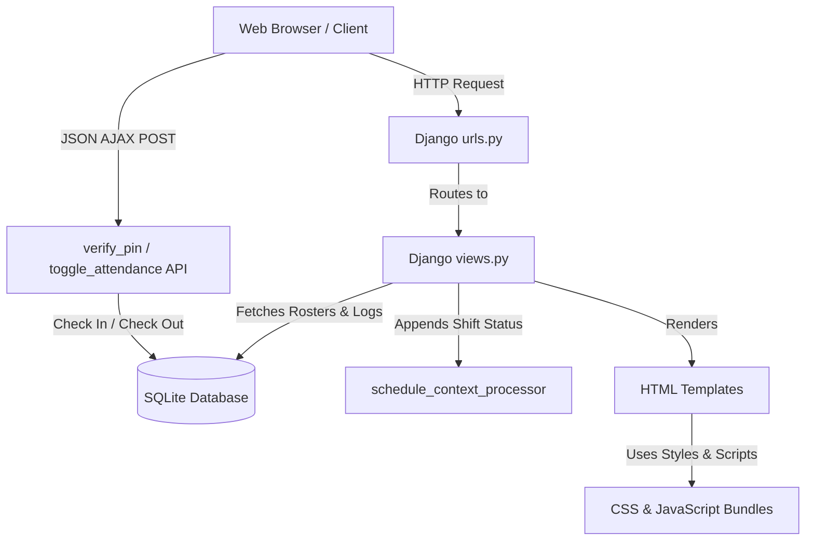

# ⏰ Leoxur Solutions Limited - Employee Time & Expense Portal

Welcome to the **Employee Time & Expense Portal** by **Leoxur Solutions Limited**! This project is a modern, responsive enterprise application designed for employee shift check-ins, check-outs, dynamic hours tracking, interactive roster planning, and unified manager oversight. It also features a fully functional ServiceNow-style IT Tech Support portal.

---

## 📐 Application Architecture

The application is built using the **Django** framework and styled with vanilla CSS (leveraging Outfit and Inter web fonts) to create a premium, glassmorphic corporate dashboard. 



---

## 📁 Step-by-Step File Descriptions

Here is a comprehensive breakdown of the directories and key files in the codebase.

### 1. Main Project Settings
* **[`employee_attendance/settings.py`](employee_attendance/settings.py)**
  * Contains the core settings for the Django framework.
  * Injects `attendance.views.schedule_context_processor` in `TEMPLATES` to ensure the operational shift ticker bar (`schedule_status`) is available globally.
* **[`employee_attendance/urls.py`](employee_attendance/urls.py)**
  * Root URL router that directs initial requests to the `attendance` app.

### 2. Models & Schema
* **[`attendance/models.py`](attendance/models.py)**
  * Defines the database schema:
    * `DepartmentOption`: Stores active departments (e.g. Engineering, HR, Sales & Marketing).
    * `Employee`: Stores active employee profiles, departments, avatar details, and secure 4-digit PINs.
    * `Roster`: Stores shift schedule assignments (`morning`, `afternoon`, `night`) for employees on specific dates.
    * `Attendance`: Logs check-in/out times, status (Present, Late), work modes (Office 🏢, Remote 🏠, Field 🚗), and calculates total hours worked.
    * `EmployeeSupportPermission`: Controls which users can raise support tickets.

### 3. Logic & Routing
* **[`attendance/urls.py`](attendance/urls.py)**
  * Maps URLs to views, handling backwards-compatible route names for integrity.
* **[`attendance/views.py`](attendance/views.py)**
  * Core backend logic:
    * `employee_grid`: Renders the Employee Time & Expense kiosk station.
    * `toggle_attendance`: Manages checking in (records work mode, checks for late check-in) and checking out (computes hours worked).
    * `manager_dashboard`: Aggregates workforce metrics, parses roster date parameters, and serves the employee roster and interactive scheduling table.
    * `assign_roster_shift`: Endpoint to create, update, or delete roster assignments for any date.
    * `ai_chat_command`: Backs the developer customizer page builder, parsing natural language commands to re-order page layout blocks.
* **[`attendance/tests.py`](attendance/tests.py)**
  * Unified test suite containing 27 unit tests validating PIN logic, manager dashboard redirects, layout APIs, and ServiceNow integrations.

### 4. HTML Templates
* **[`attendance/templates/attendance/base.html`](attendance/templates/attendance/base.html)**
  * Main layout containing the global active shift announcement ticker and navigation bar.
* **[`attendance/templates/attendance/student_grid.html`](attendance/templates/attendance/student_grid.html)**
  * The **Employee Time & Expense** check-in kiosk page.
* **[`attendance/templates/attendance/teacher_dashboard.html`](attendance/templates/attendance/teacher_dashboard.html)**
  * The Manager Dashboard with quick stats, an interactive Shift Roster Scheduler table (for date-specific create, update, and delete actions), and override controls.

### 5. Static Assets
* **[`static/css/employee_theme.css`](static/css/employee_theme.css)**
  * Standardized premium stylesheets: glassmorphism, steel-blue color variables, clean border designs, and dark/light modes.
* **[`static/js/employee_attendance.js`](static/js/employee_attendance.js)**
  * Manages AJAX kiosk verification flow, keypad entries, and modal transitions.

---

## 🛠️ IT Tech Services Portal (ServiceNow Theme)

An integrated, ServiceNow-themed IT service portal is available for staff:
* **Ticket Submission**: Users can submit help desk tickets and look up statuses under `/support/`.
* **Tech Services Console**: Located at `/support/engineer/` for authorized support engineers. Allows ticket lifecycle tracking (New, In Progress, On Hold, Resolved, Closed), SLA timer auditing, and internal-only **Work Notes** logging.
* **Identity Manager**: Located at `/support/engineer/identity/`, allows engineers to toggle ticket permissions and engineer assignments.
* **Logout Page**: A dedicated logout confirmation screen at `/support/engineer/logout/` terminates the active engineer session and provides action controls to log back in or return to the main portals.

---

## ⚙️ Running Seeding and Tests

To seed the database with configurations and mock data (creating default employees with roster schedules and logged hours), run:

1. **Seed default configurations (departments, avatar emojis, colors):**
   ```bash
   venv/bin/python manage.py seed_configurations
   ```
2. **Seed employee rosters and check-in logs:**
   ```bash
   venv/bin/python seed_data.py
   ```
3. **Execute the automated test suite:**
   ```bash
   venv/bin/python manage.py test
   ```
