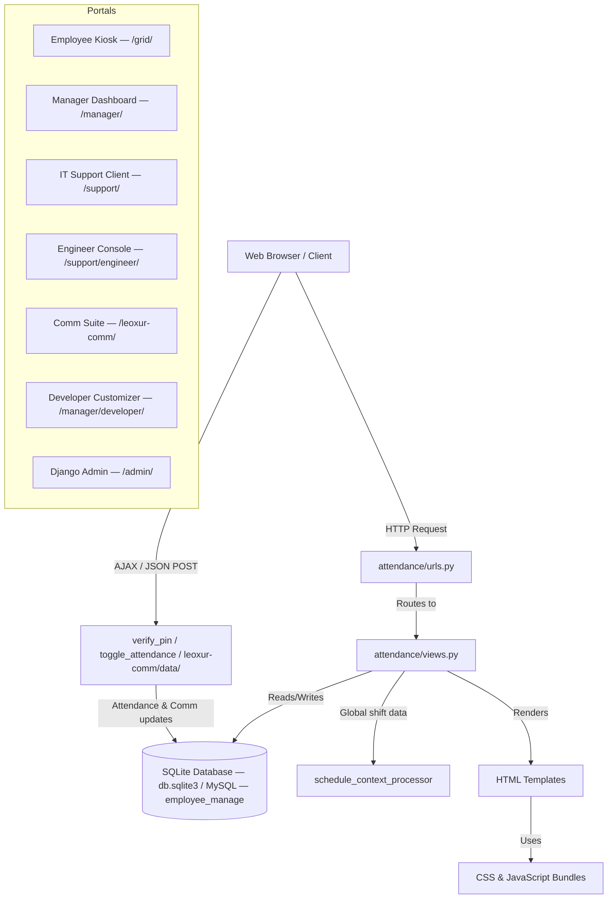

# ⏰ Leoxur Solutions Limited — Employee Time & Management Portal

> A modern, full-featured enterprise portal for employee attendance, shift scheduling, IT support ticketing, and internal communication — built on Django with a premium glassmorphic UI.

---

## 📑 Documentation Index

Please refer to the following sub-guides for detailed setups and functional references:

*   💻 **[Local Development Setup Guide](docs/local_development.md)** — Step-by-step virtualenv, SQLite, and database seeding guide.
*   🐳 **[Docker & Containers Guide](docs/docker_guide.md)** — Docker Compose, raw commands, and database volume resetting guide.
*   ☁️ **[Cloud Deployment & Operations](docs/deployment.md)** — AWS EC2, Azure, and GCP setups, security checksheets, and deployment upgrades.
*   📊 **[Monitoring Stack Guide](docs/monitoring.md)** — Prometheus, cAdvisor, Node Exporter, and Grafana dashboard guides.
*   📚 **[Portal Features & Pages Manual](docs/features_guide.md)** — Functional overview of the Kiosk, Manager Dashboard, ITSM tickets, and Mails/Chat suite.
*   🗄 **[Database Schema & Models Reference](docs/database_schema.md)** — Models schema descriptions, shift rules, and SQLite-to-MySQL data migration.
*   🔗 **[API Routes & Assets Reference](docs/api_routes.md)** — Full URL patterns directory and CSS/JS asset layout.
*   🔑 **[SQL Useful Commands Cheatsheet](docs/sql_useful_commands.md)** — Dockerized database login guide and SQL queries cookbook.

---

## 📐 Application Architecture



---

## 🛠 Tech Stack

| Layer | Technology | Description |
|---|---|---|
| Backend Framework | Django 4.2.x | Main core framework |
| Language | Python 3.10 | Runtime |
| Database | SQLite 3 / MySQL 8.0 | File db (dev) / Containerized db (prod) |
| WSGI Server | Gunicorn | Production web server in Docker |
| Static File Serving | WhiteNoise 6.x | Serves css/js bundles |
| Styling | Vanilla CSS | CSS variables, custom themes |
| Scripting | Vanilla JavaScript | AJAX Fetch, PIN modal keypad, Audio chime |
| Containerization | Docker + Compose | Multi-container stack deployment |

---

## 📋 Project File Structure

```
EmployeeManagementTool/
├── attendance/
│   ├── management/
│   │   └── commands/
│   │       └── seed_configurations.py   # Seeds departments, avatar emojis, colors
│   ├── migrations/                      # Django database migration files
│   ├── templates/
│   │   └── attendance/
│   │       ├── base.html                # Global layout (shift ticker, nav)
│   │       ├── home.html                # Landing page
│   │       ├── employee_grid.html       # Employee kiosk check-in
│   │       ├── manager_dashboard.html   # Manager dashboard
│   │       ├── login.html               # Manager login/register
│   │       ├── employee_form.html       # Add/edit employee form
│   │       ├── employee_confirm_delete.html
│   │       ├── developer_page.html      # Admin customizer & AI chat
│   │       ├── leoxur_comm.html         # Mails, Chat & Tasks suite
│   │       ├── support_home.html        # IT support client portal
│   │       ├── support_ticket_detail.html
│   │       └── support/
│   │           ├── support_base.html    # Base layout for support pages
│   │           ├── engineer_login.html
│   │           ├── engineer_logout.html
│   │           ├── engineer_dashboard.html
│   │           ├── engineer_ticket_detail.html
│   │           ├── identity_manager.html
│   │           ├── engineer_list.html
│   │           ├── engineer_form.html
│   │           ├── engineer_confirm_delete.html
│   │           ├── group_list.html
│   │           ├── group_form.html
│   │           └── group_confirm_delete.html
│   ├── admin.py                         # Django admin registrations
│   ├── forms.py                         # EmployeeForm
│   ├── models.py                        # All 15 database models
│   ├── tests.py                         # Automated test suite
│   ├── urls.py                          # URL routing (40+ routes)
│   └── views.py                         # View layer logic
├── employee_attendance/
│   ├── settings.py                      # Django settings
│   ├── urls.py                          # Root URL dispatcher
│   └── wsgi.py
├── static/
│   ├── css/
│   │   ├── employee_theme.css           # Main portal theme
│   │   ├── servicenow_theme.css         # IT support portal theme
│   │   └── leoxur_comm.css              # Comm suite theme
│   └── js/
│       └── employee_attendance.js       # Frontend JS logic
├── docs/                                # Project documentation folder
├── Dockerfile                           # Docker image definition
├── docker-compose.yml                   # Docker Compose container definition
├── deploy.sh                            # Automated cloud VM deployment script
├── manage.py                            # Django entry point
├── requirements.txt                     # Dependencies
└── seed_data.py                         # Local data seeder
```

---

## 🚀 Release Notes & Latest Updates (v1.2.0)

The latest version of the Employee Time & Management Portal introduces critical security patches, refined UI configurations, and advanced collaborative tools:

*   **Enhanced Access Security**: Upgraded the Kiosk system login to require a secure **6-digit PIN** instead of the previous 4-digit setup.
*   **Flexible Database Deployments**: Interactive `deploy.sh` script now supports seamless setup and migrations for both standard **SQLite** and containerized **MySQL 8.0** databases.
*   **Robust Connection Waiter**: Replaced the static boot sleep timer in `deploy.sh` with a dynamic Django database connection checker loop that polls database socket readiness, resolving container migration race conditions.
*   **Database Administration Web UI**: Introduced a containerized **phpMyAdmin** dashboard accessible at port `8080` (with secure login credentials authentication) to view and manage data from your web browser.
*   **Refined Tech Themes**: Restructured the visual layout with a custom slate-indigo color scheme for both **Light Mode** and **Dark Mode** toggle configurations.
*   **Email CC Multi-recipient support**: Added custom database mapping and multi-select recipient search selectors to include CC'd users in Leoxur email delivery streams.
*   **Responsive Inline Dashboard Panes**: Replaced task board creation and edit overlay popups with dedicated inline split-column grids designed to scroll independently and scale smoothly across desktop, tablet, and mobile views.
*   **Workspace Mobile Collapse**: Configured tabs navigation list on mobile viewports to start collapsed under a toggleable menu bar, preventing screen clutter.
*   **Integrated Monitoring Stack**: Deployed Prometheus, cAdvisor, Node Exporter, and Grafana (pre-provisioned with custom dashboards for container analytics and node resource utilization) to monitor live container networks and system health metrics.

---

## 📄 License

This project is licensed under the **Apache License 2.0**. See the [`LICENSE`](LICENSE) file for full details.

---

*Built with ❤️ by the Leoxur Solutions Limited development team.*
